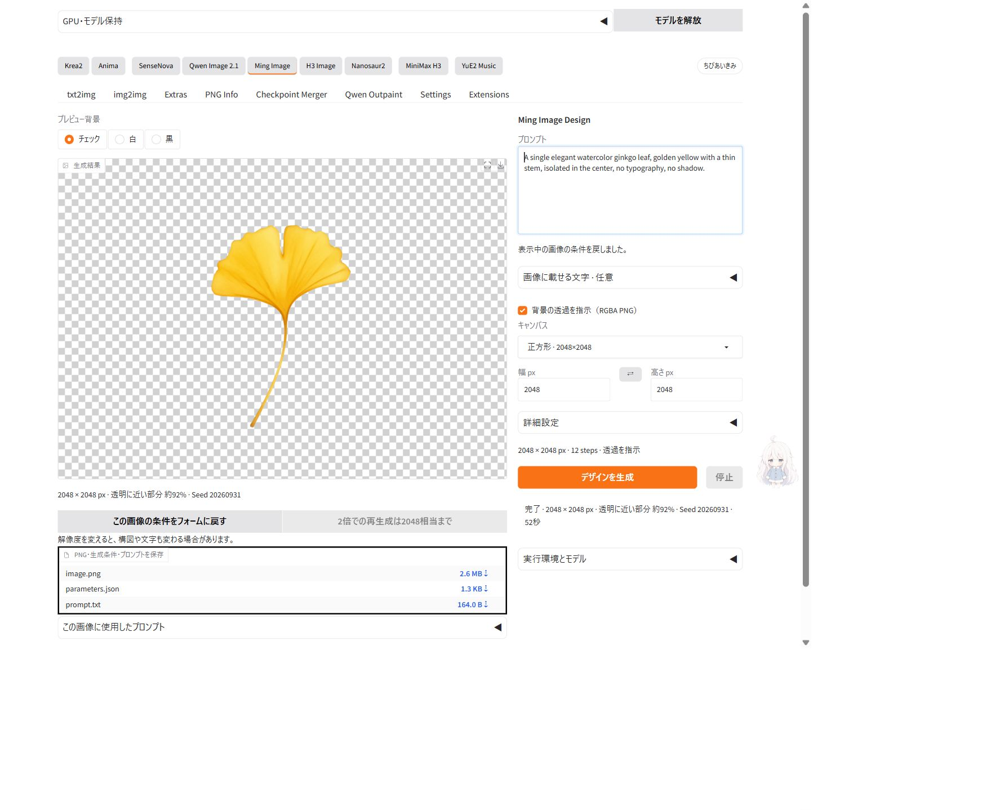
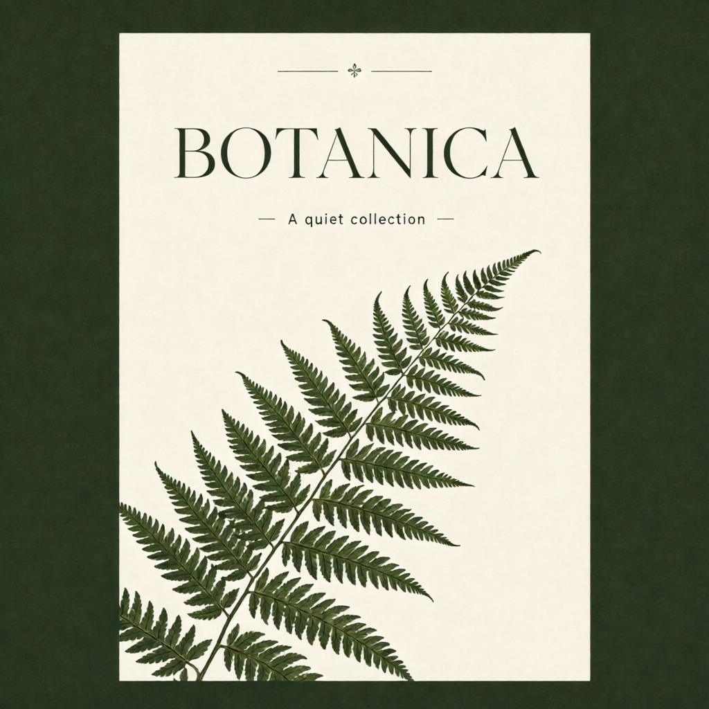
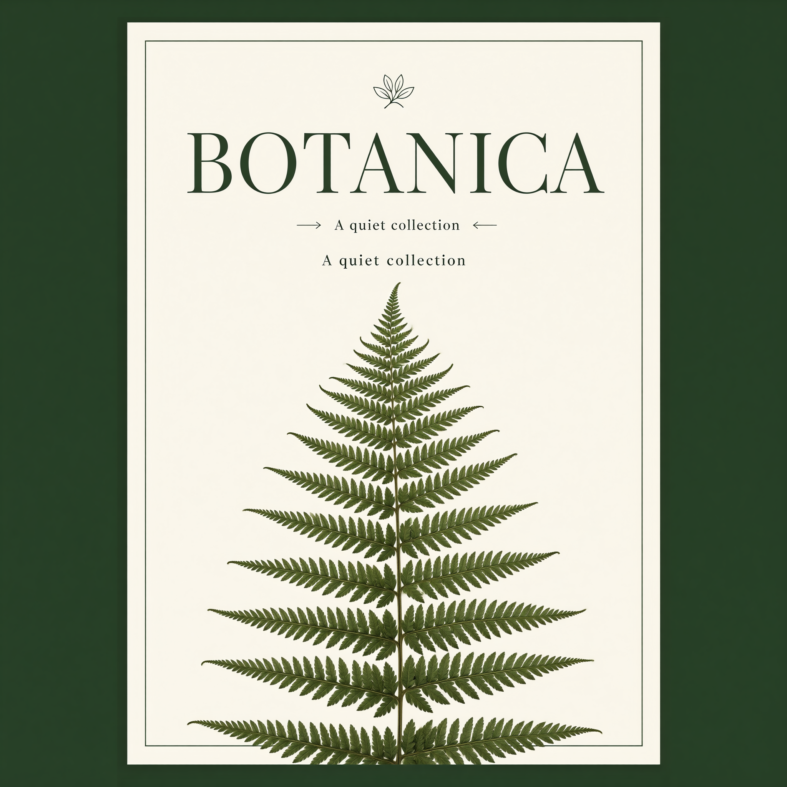
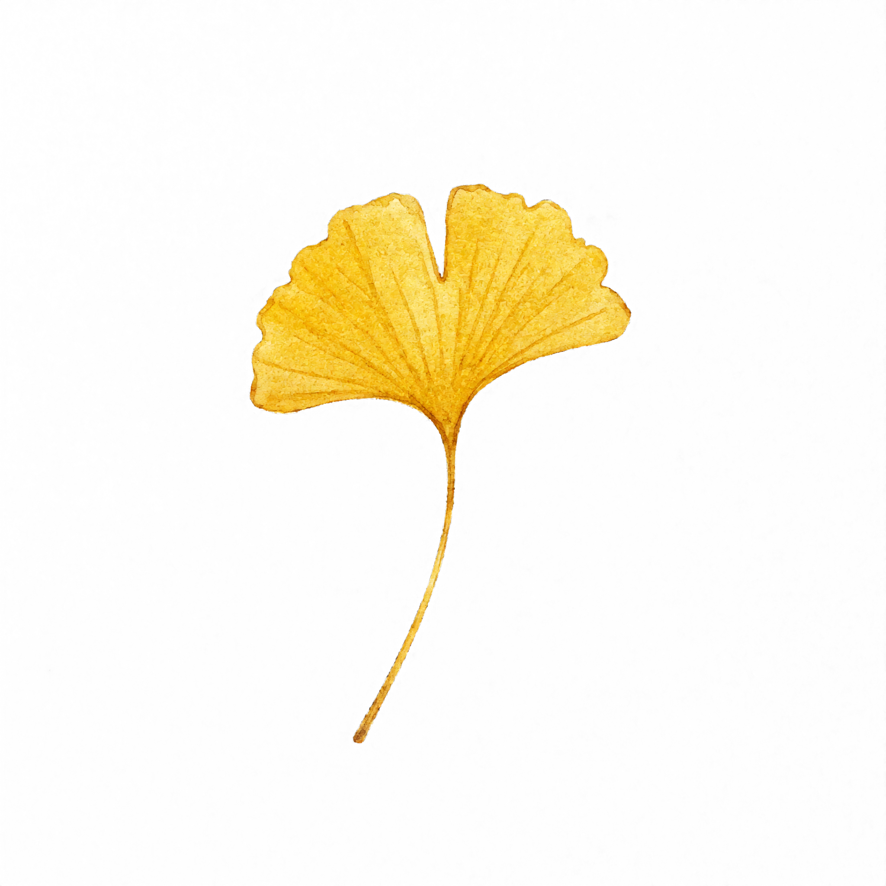

# Ming Image v3.2.0 実生成記録

RTX 3090 24GiB / RAM 64GB、2026-09-29。本体INT8 ConvRot＋テキストエンコーダーW4A8、Euler/simple、12 steps、CFG 1。画像はMingの生成PNG原本です。

## 実装画面

2048pxの生成結果と、実際のalphaから計測した透過面積を表示しています。入力条件の復元、保存済みの条件による再生成、PNGの保存まで実機で確認しました。

[幅390pxでの表示](studio-mobile.jpg)。狭い画面では入力欄を先に配置し、Mingタブのマスコットを隠して結果の操作を妨げないようにしています。

## 1024と2048の再生成

同じプロンプト・Seed 20260930です。1024はモデル保持後で約8秒、2048は約54秒。2048では構図が変わり、副題が2回描かれました。高解像度への再生成は拡大処理ではなく、文字や構図の改善を保証しません。

条件: [1024](poster-1024.json) / [2048](poster-2048.json)

## 透過素材

英語のイチョウ指示、Seed 20260931、2048×2048で約50秒。RGBAのalphaは0〜255、alpha16以下の面積は約92%です。同じ指示・Seedの1024出力はほぼ不透明だったため、透過指示を出したことと実際の出力を区別しています。

[生成条件と使用プロンプト](transparent-2048.json)。透過の確認用背景を変えてもPNG原本は変わりません。輪郭や半透明部分の品質は用途に合わせて確認してください。

詳細な導入手順・ベンチマークの範囲は [Mingガイド](../../../extensions-builtin/ming-image-studio/README.md) を参照してください。
