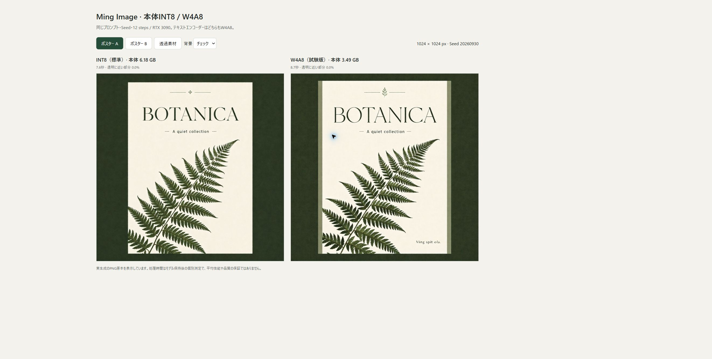
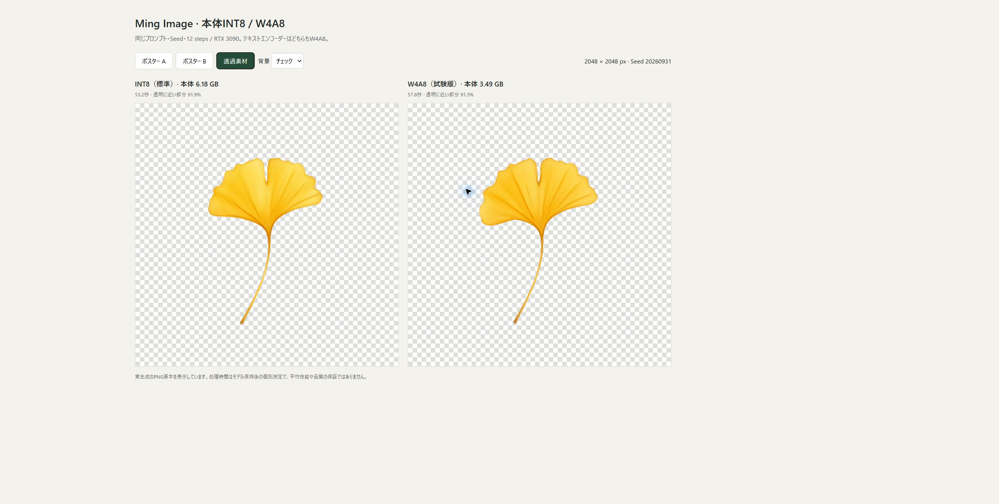
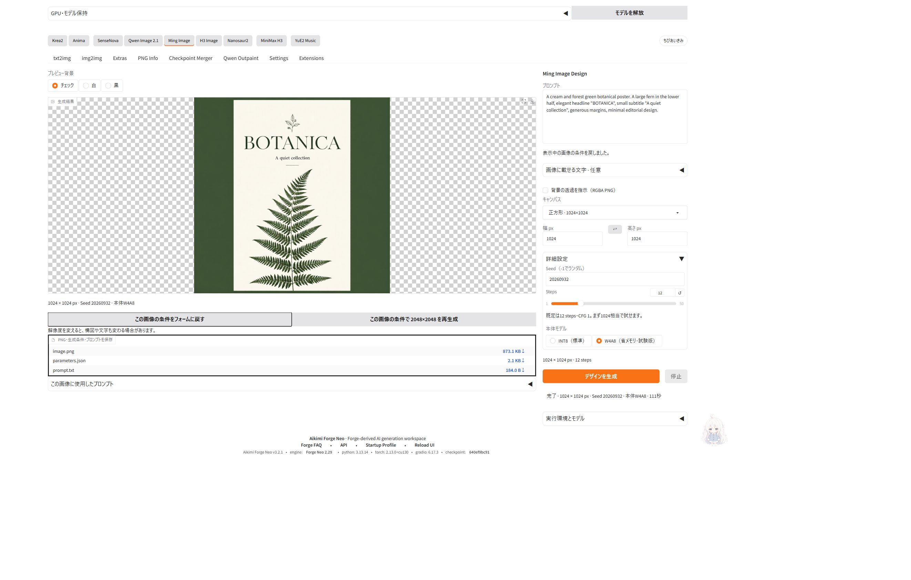

# Ming Image 本体W4A8 実生成記録

2026-09-29、Windows・RTX 3090 24GiB・RAM 64GB。v3.2.1で追加した任意の本体W4A8と、標準INT8を同じプロンプト・Seedで比較しました。テキストエンコーダーは両方W4A8、VAEはBF16、Euler/simple・12 steps・CFG 1です。

## 結果

| 条件 | INT8 所要時間 | W4A8 所要時間 | INT8 GPU標本最大 | W4A8 GPU標本最大 |
|---|---:|---:|---:|---:|
| ポスターA・1024²・Seed 20260930 | 7.62秒 | 8.71秒 | 20729 MiB | 18282 MiB |
| ポスターB・1024²・Seed 20260932 | 7.39秒 | 8.54秒 | 20533 MiB | 18236 MiB |
| 透過素材・2048²・Seed 20260931 | 53.21秒 | 57.81秒 | 21711 MiB | 21352 MiB |

本体ファイルは約6.18GBから3.49GBへ減りました。今回の1024px生成ではGPU使用量が約2.4GiB減り、2048pxでは約0.35GiBの差でした。いずれもW4A8の方が遅くなっています。INT8を標準とし、W4A8は余裕を増やしたい場合の試験版として選択します。

## ポスター

同条件のポスターAです。両方とも見出し「BOTANICA」と副題を読めます。W4A8では右下に指定していない小さな文字列が出ました。1例から発生頻度や精度全体の優劣は判断していません。

## 透過素材

両方とも実際に透明部分を持つRGBA PNGです。alpha16以下の面積はINT8が91.888%、W4A8が91.451%でした。葉の形・葉脈は変わり、面積の近さは品質の同等性を示しません。比較画面のチェック背景は表示専用です。

## 条件と限界

- [生成条件・計測値・モデル変換記録](benchmark.json)。掲載画像は実出力を並べたブラウザー画面のスクリーンショットで、元PNGの画素等倍比較ではありません。
- 各精度で専用環境を起動し、別Seedで1回ウォームアップした後、ポスターA、ポスターB、透過素材を順に1回ずつ生成しました。所要時間は本番の生成処理が返すジョブ受付後の経過時間で、事前の起動・ファイルハッシュ検証を除きます。
- GPU全体の使用量を `nvidia-smi` で約0.8秒＋計測処理時間ごとに取得しました。他アプリ・画面表示を含み、瞬間的な真のピークは捉えられません。測定対象間で常駐アプリを完全には統制していません。
- 初回はディスクキャッシュ条件が異なり、INT8測定の一部でBF16の取得が同時進行していたため、初回の所要時間は速度比較に使っていません。モデル保持後も各条件1回の少数測定です。
- Python 3.12.13、PyTorch 2.11.0+cu130、comfy-kitchen 0.2.35、ComfyUI 0.37.0（`3b4c0b0e457cf0a51cf3038e0a6750d8f96ce251`）。他GPUやRAM容量での必要量は未検証です。

## UI確認

詳細設定でW4A8を選んで生成し、保存JSONの本体精度・モデル名・変換記録を確認しました。その後フォームをINT8・別Seedへ変更し、結果の「この画像の条件をフォームに戻す」でW4A8・Seed 20260932に戻ることを確認しています。画面の111秒は初回読み込みを含む別のUI確認で、上表のモデル保持後の時間とは条件が異なります。

## 変換方法

固定版のBF16原本から変換しました。INT8を再量子化していません。固定版ComfyUIの公式対応表でQ/K/Vを結合してから、[Comfy-Org公式量子化ツール](https://github.com/Comfy-Org/comfy-model-tools/blob/d6797787e6bdb1a1fb0094d588a26f8e71a1c757/quant_int8_convrot.py)のW4A8 ConvRotを適用しています。202層・group size 16・ConvRot group size 256、出力3,488,163,008 bytes。対象外の層は元精度です。

配布INT8に合わせてAttention設定のメタデータも保持しています。ただし、今回の固定版Ming実装は両精度でその設定キーを未使用として報告するため、この記録はINT8 Attentionカーネルの使用を証明するものではありません。W4A8線形層の読み込みと画像生成を確認しています。

導入・UI操作は [Mingガイド](../../../extensions-builtin/ming-image-studio/README.md) を参照してください。
