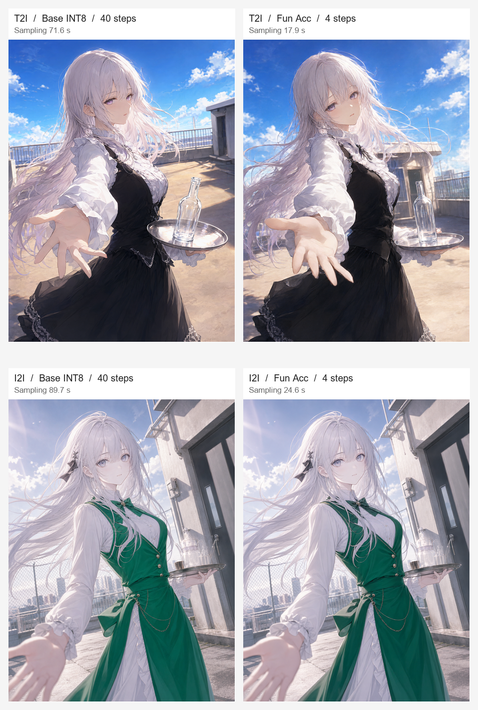
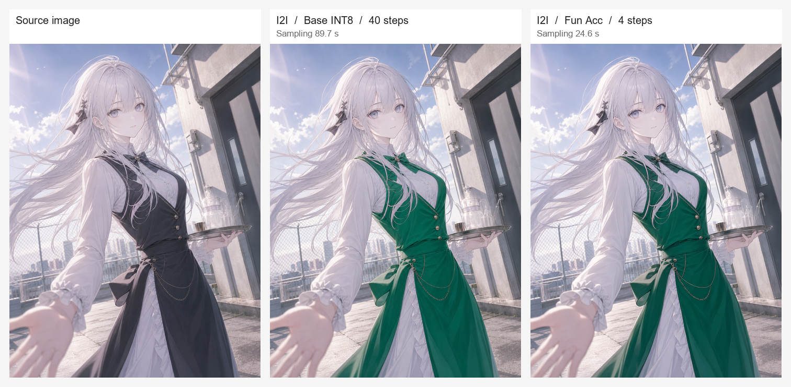

# Qwen Image 2.1 Fun Acc · T2I / I2I比較

2026年9月25日、RTX 3090で通常版INT8と[Fun Acc 4-step LoRA](https://huggingface.co/alibaba-pai/Qwen-Image-2.1-Fun-Acc-LoRAs)をそれぞれ新規生成（T2I）・参照画像編集（I2I）で実行しました。入力はユーザー提供のアニメCGです。T2Iでは画像の場面を短い日本語で説明し、I2Iでは元画像の**黒いベストとスカートだけを深い緑に変更**するよう指示しました。

[4枚の一覧を原寸で見る](comparison.png)

## 比較条件

出力はすべて960×1280・RGBA PNGです。通常版INT8・CPU退避で、Sparse AttentionとFun ControlNetはOFF。T2Iの生成モデルには画像を渡さず、元指示を導入済みの`Qwen-Image-2.1-PE-T2I`で強化しました。I2Iでは元指示と参照画像を`Qwen-Image-2.1-PE-I2I`へ渡して強化しました。**各ペアには同じ強化後プロンプトとSeed**を渡しています。[元指示と強化後の全文](prompts.json)を保存しました。

通常版はQwen本体の`FlowMatchEulerDiscreteScheduler`で既定の40 steps、Fun Accは配布元指定の`QwenImage21PDDScheduler`で4 stepsです。モデル本体とテキストエンコーダーは両方ともbitsandbytes INT8、Fun AccのLoRA差分とPDD出力ヘッドは浮動小数点です。

| 用途 | LoRA | Seed | Steps・スケジューラ | 生成処理 | モデル読込 | 原寸 |
| --- | --- | ---: | --- | ---: | ---: | --- |
| T2I | なし | 20260527 | 40・FlowMatch Euler | 71.6秒 | 489.2秒 | [PNG](t2i-base.png) |
| T2I | Fun Acc | 20260527 | 4・専用PDD | 17.9秒 | 276.9秒 | [PNG](t2i-fun-acc.png) |
| I2I | なし | 20260528 | 40・FlowMatch Euler | 89.7秒 | 再利用 | [PNG](i2i-base.png) |
| I2I | Fun Acc | 20260528 | 4・専用PDD | 24.6秒 | 再利用 | [PNG](i2i-fun-acc.png) |

この1組での**生成処理**はT2Iが4.01倍、I2Iが3.64倍速でした。プロンプト強化、モデル読込、画面操作は速度比に含めていません。強化モデルの実行はT2Iが204.9秒、I2Iが213.4秒。モデル読込は実行順やディスクキャッシュの影響を受けるため、表の差をLoRAの性能差とは解釈できません。各出力のSHA-256、モデルrevision、設定、PyTorchのGPU割当ピークは[測定データ](conditions.json)に記録しています。

## 画像の観察

T2Iは両方とも銀髪の少女、屋上、トレーと瓶を描きました。同じ文章とSeedでもスケジューラとステップ数が異なるため、人物の角度や建物、手の形は一致しません。I2Iは両方とも衣装を緑に変更し、元画像の人物と屋上をおおむね維持しています。

[元画像とI2Iの比較を原寸で見る](i2i-comparison.png)

I2Iの両結果では、黒のまま残すつもりだった襟元のリボンも緑になりました。背景や顔も画素単位では保持していません。これはマスクによる部分固定を使わない通常の参照画像編集です。画質と保持率の観察は**各条件1枚**に限られ、一般的な優劣の判定ではありません。[元画像のPNG](source.png)も保存しています。
