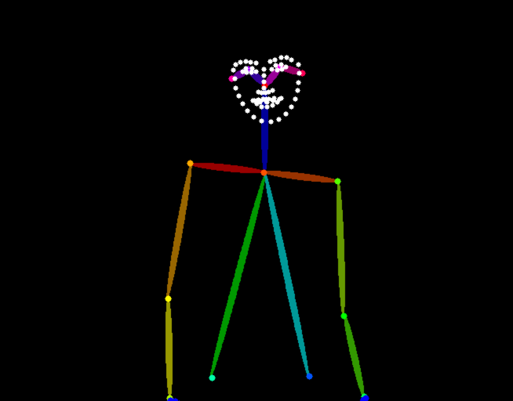
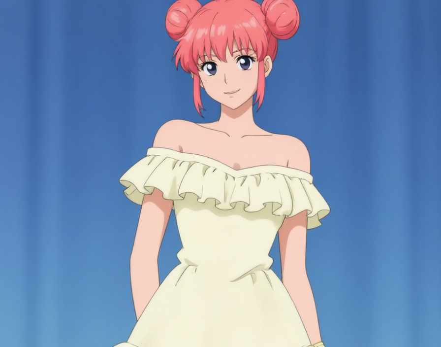
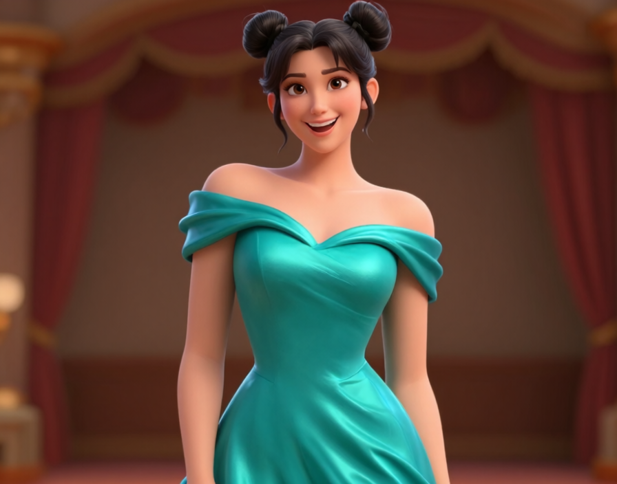
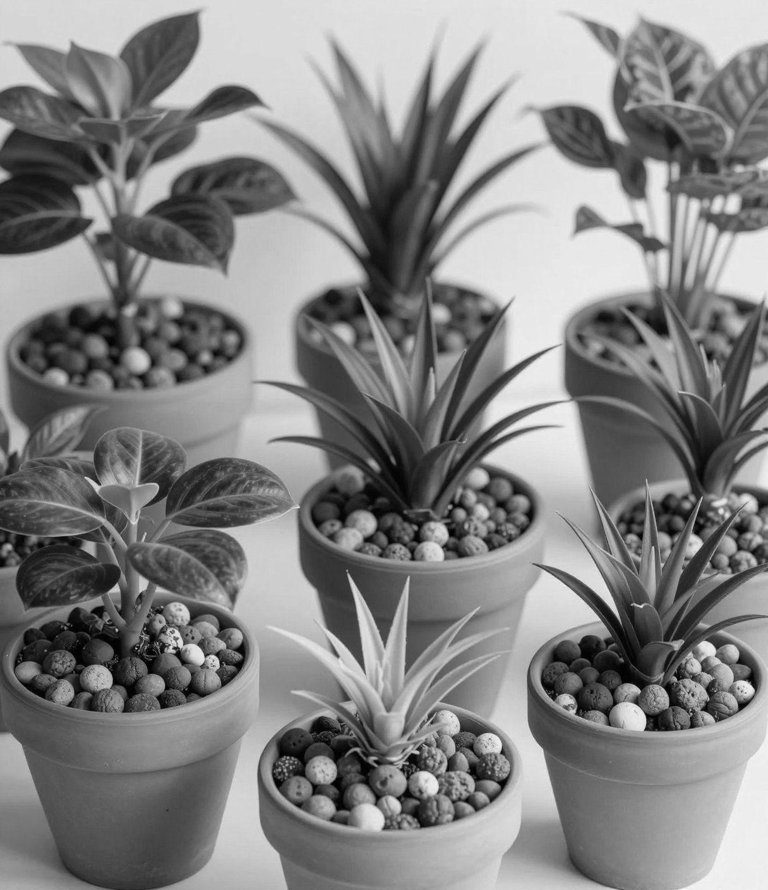
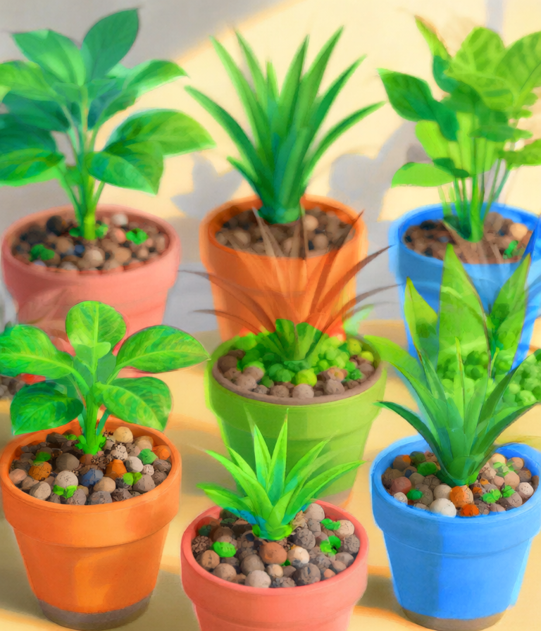
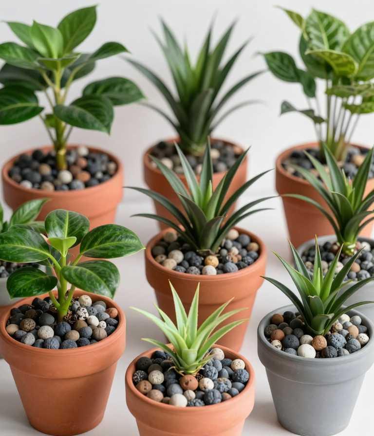
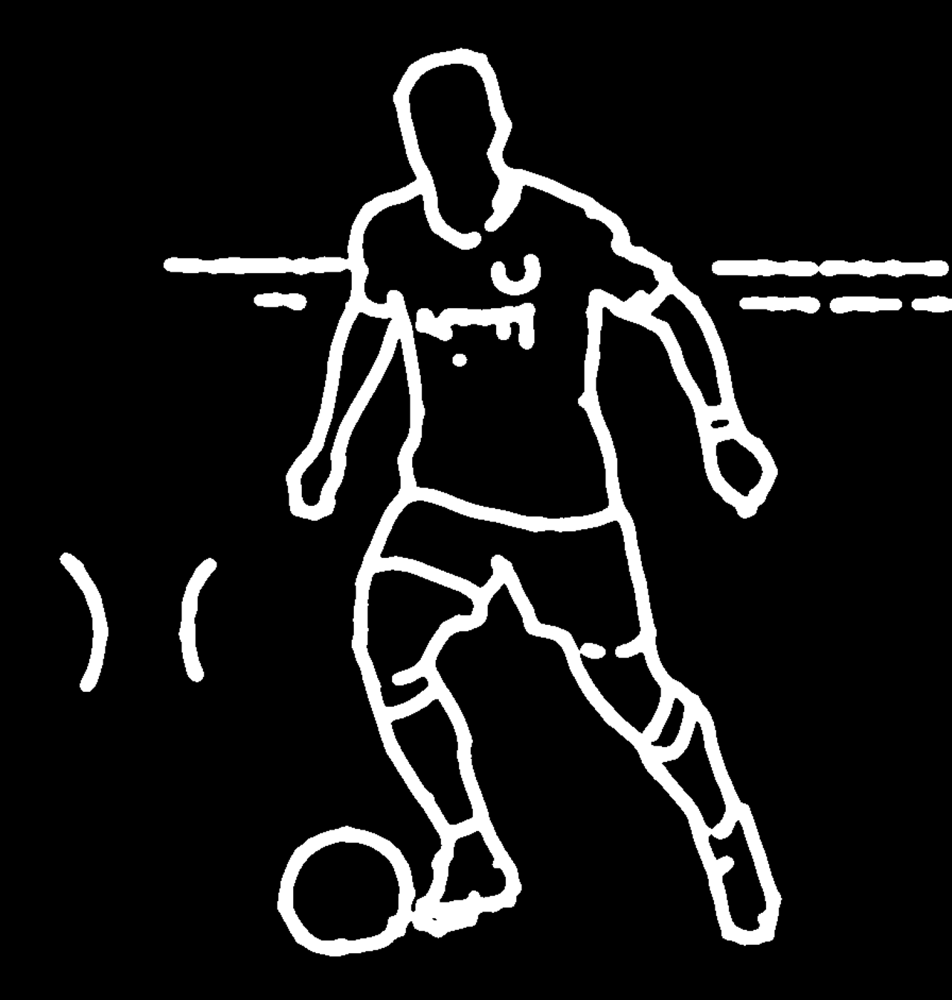
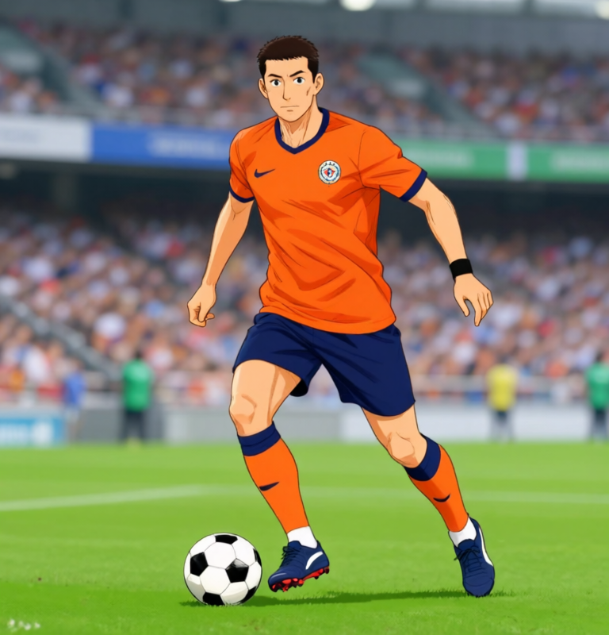
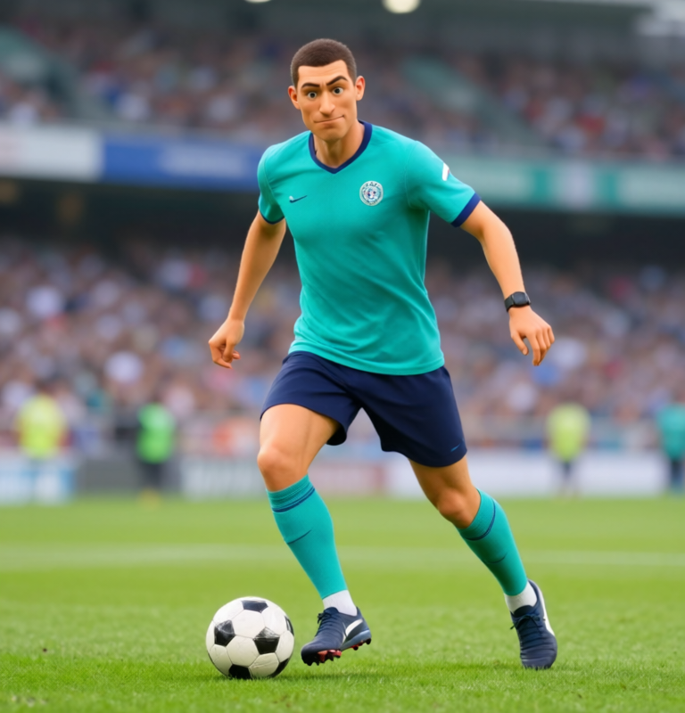

# Qwen Image 2.1 Fun ControlNet Union · INT8 作例

2026年9月24日に、同じ制御画像からプロンプトを変えてアニメ調と3D調を生成しました。画像は生成PNGの全体で、切り抜きや色調補正はしていません。Seedはすべて `43`、制御強度は[測定JSON](measurements.json)に記録しています。

| 制御画像 | アニメ調 | 3D調 |
|---|---|---|
| [Pose](pose-control.png)<br> | [PNG](pose-anime.png)<br> | [PNG](pose-3d.png)<br> |
| [Gray](gray-control.png)<br> | [PNG](gray-anime.png)<br> | [PNG](gray-3d.png)<br> |
| [Scribble](scribble-control.png)<br> | [PNG](scribble-anime.png)<br> | [PNG](scribble-3d.png)<br> |

Poseは同じ肩・腕の配置を保ちながら2Dと3Dの人物像に変わりました。Grayは強度`1.0`だと元写真の細部を強く保つため、アニメ背景調だけ`0.4`にして筆致を出しています。Scribbleは元画像に合うサッカー選手とボールを指定し、`0.65`で輪郭と顔の描写を両立させました。Poseの制御画像は全身の骨格ですが、この出力は上半身中心です。骨格の厳密な再現は保証されません。

| 作例 | サイズ | 強度 | 生成処理 | PyTorch GPU割当ピーク |
|---|---:|---:|---:|---:|
| Pose · アニメ | 896×704 | 1.0 | 144.9秒 | 12,007.8 MiB |
| Pose · 3D | 896×704 | 1.0 | 45.1秒 | 12,007.2 MiB |
| Gray · アニメ背景調 | 768×896 | 0.4 | 48.3秒 | 12,086.0 MiB |
| Gray · 3D | 768×896 | 1.0 | 49.2秒 | 12,084.7 MiB |
| Scribble · アニメ | 768×800 | 0.65 | 44.6秒 | 11,985.7 MiB |
| Scribble · 3D | 768×800 | 0.65 | 44.7秒 | 11,987.3 MiB |

最初のPoseアニメはモデルの再読込後の初回推論で、生成処理が長くなりました。モデル読込は別計測で282.7秒です。残り5枚は同じworker内でモデルを再利用しました。数値は各1回の測定です。

## 再現条件

- Windows 11、RTX 3090 24GB、Qwen Image 2.1通常版INT8、CPU退避、Sparse OFF、プロンプト書き換えOFF、Seed `43`。制御重みはKijaiのINT8 ConvRot（SHA-256 `07aa961570ac0e03d4ca936aecd76854d077a33cde69b5092399afba01b3715d`）。
- 制御画像は[公式モデルの配布物](https://huggingface.co/alibaba-pai/Qwen-Image-2.1-Fun-Controlnet-Union/tree/8a4702014d4dabb5f896fcba917e2ee0a961465f/asset)の `control_4_00000931.png`、`control_1_00014291.png`、`control_13_00000494.png` を使用。生成時に出力サイズへ中央切り抜き・リサイズされます。
- プロンプト・サイズ・ステップ数・生成時間・PNGのSHA-256・PyTorchのGPU割当ピークは[測定JSON](measurements.json)に記録しています。GPU割当量はデスクトップやCUDAコンテキストを含むGPU全体の使用量ではありません。各条件1回の生成で、平均や画質の保証ではありません。
- モデル導入とUI操作は[Qwenガイド](../../../extensions-builtin/qwen-image21-studio/README.md#fun-controlnet-union--int8)。全作例は専用環境で次のコマンドから再生成できます。

```powershell
.\models\Qwen-Image-2.1\worker-env\Scripts\python.exe tools\generate_qwen21_fun_examples.py
```

制御画像の種類は記録用です。線やポーズの自動抽出は行いません。転載した公式制御画像には非商用の[Qwen Research License](LICENSE.qwen-research.txt)と[帰属表示](NOTICE)が適用されます。
