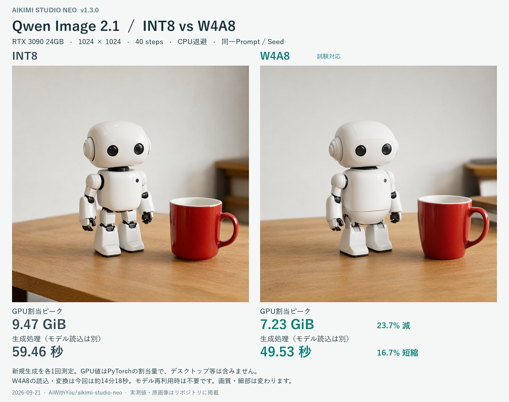

# Qwen Image 2.1：INT8 / W4A8比較

Aikimi Studio Neo v1.3.0のQwen Image 2.1新規生成を、2026年9月21日に同じPC・入力条件で比較しました。各1回の実測であり、平均値や画質の同等性を示す評価ではありません。



[比較画像を原寸で開く](comparison.png) · [INT8の原画像](int8.png) · [W4A8の原画像](w4a8.png) · [実測JSON](benchmark.json) · [実測CSV](benchmark.csv)

## 条件と数値の意味

- RTX 3090 24GB、Windows、1024×1024、40 steps、CPU退避、Seed `9212026`。プロンプト書き換えはOFF。
- モデルは `Qwen/Qwen-Image-2.1`。固定revisionと環境の版は `benchmark.json` に記録しています。
- 画像は両方とも生成された1024角のPNG全体です。切り抜き、色調補正、レタッチはしていません。原画像のSHA-256もJSONに含めています。
- GPU割当ピークはPyTorchの `max_memory_allocated` です。デスクトップ、CUDAコンテキストなどを含むGPU総使用量ではありません。
- 生成時間にはプロンプト処理、デノイズ、VAEによる画像変換を含み、モデル読込は含みません。

| 項目 | INT8 | W4A8 | この試行での差 |
|---|---:|---:|---:|
| GPU割当ピーク | 9,699.0 MiB（9.47 GiB） | 7,404.5 MiB（7.23 GiB） | 23.7%減 |
| 生成処理 | 59.460秒 | 49.530秒 | 16.7%短縮 |
| モデル読込・変換 | 828.671秒 | 858.544秒 | 比率比較の対象外 |

モデルはUSB接続SSDに保存しています。読込時間はディスクキャッシュの状態などにも左右されるため、この測定から読込の優劣を断定しません。このv1.3.0の測定時点ではW4A8を読み込み時に変換し、再起動・解放後に再変換していました。v1.4.0では[変換済みモデルの永続保存](../../w4a8.md)を追加しています。

プロンプトは共通です。

```text
A realistic studio photograph of a small white ceramic robot beside a red mug on an oak desk, soft daylight, clear fine surface details, clean background.
```

## 画質と検証範囲

同じSeedでもロボットの細部やカップの形が変わります。この比較は新規生成の一例です。文字の再現性、人物、複雑な構図などの包括的な画質評価は行っていません。

参照編集でも両方式を比較していますが、同じ条件で双方に背景が粗くなる例がありました。W4A8固有の回帰とは判定していません。参照編集やモデル再利用の測定、追加確認は[量子化監査記録](../../quantization-audit-2026-09-21.md)を参照してください。

比較画像を紹介に使う場合は「各1回の実測」「GPU割当量」「モデル読込を除く」「画質・細部が変わる」の条件を添えてください。[導入方法と対応GPU](../../w4a8.md)
