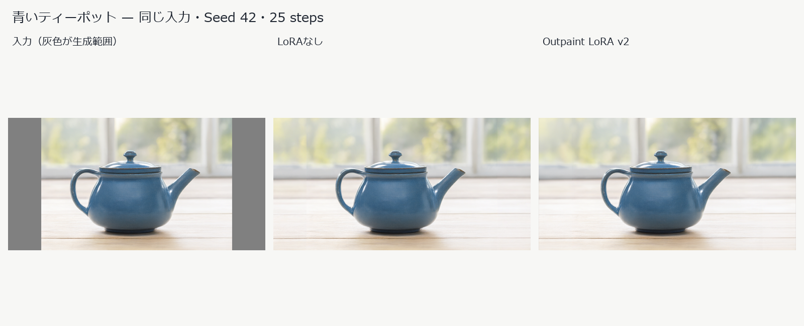

# Qwen Outpaint：LoRAなし／v2の3画像比較

2026-10-02にRTX 3090で比較しました。通常版Q4_K_M・CPU退避・25 steps・Seed 42・境界幅0を共通にし、Outpaintの追加LoRAだけを「なし」と「v2」に切り替えています。参照・指示・元画像合成は共通です。v2の固定revisionは`449336db42ff074aee970ba0facc0ac0feb77863`です。

| 題材 | 比較画像 | 生成処理 なし／v2 | 合成後の元画像 |
|---|---|---|---|
| 青いティーポット | [比較](street-comparison.png) · [なし](street-none.png) · [v2](street-v2.png) | 35.472／33.593秒 | RGBA全画素一致 |
| アニメ人物 | [比較](anime-comparison.png) · [なし](anime-none.png) · [v2](anime-v2.png) | 33.938／35.064秒 | RGBA全画素一致 |
| 海上の建築 | [比較](architecture-comparison.png) · [なし](architecture-none.png) · [v2](architecture-v2.png) | 35.691／36.324秒 | RGBA全画素一致 |

ファイル名の`street`は青いティーポットのケースを指します。各ケースの`source`が元画像、`reference`が余白付き参照、`raw`が元画像を合成する前の生成結果です。元画像領域のPSNRは合成前の保持具合を測る値で、描き足した領域の画質順位を示しません。3作例で全般的な優劣は断定できません。

同じ条件の再生成には、Qwen本体・専用環境・v2 LoRAを準備してから以下を実行します。成功済みのジョブは照合して再利用します。

```powershell
models/Qwen-Image-2.1/worker-env/Scripts/python.exe tools/compare_qwen21_outpaint.py
```



