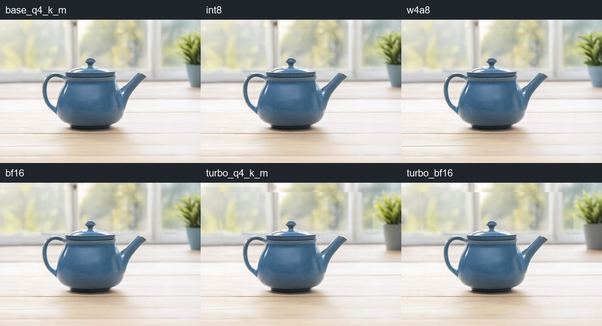
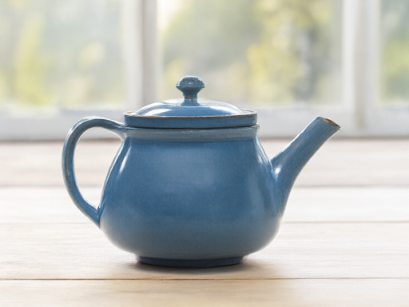
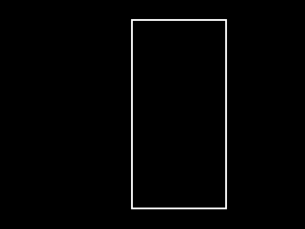
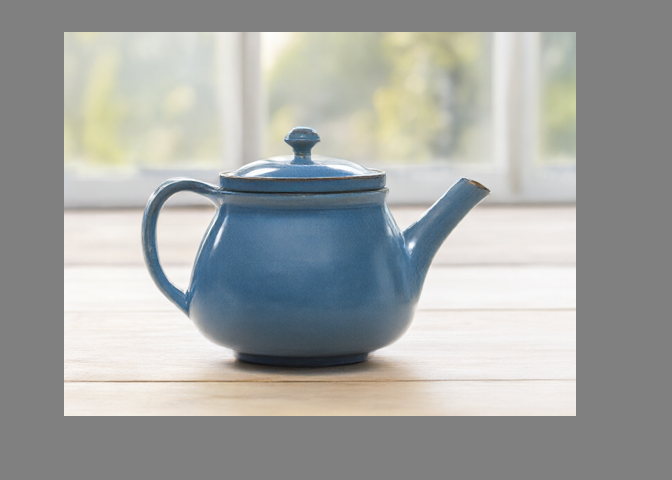
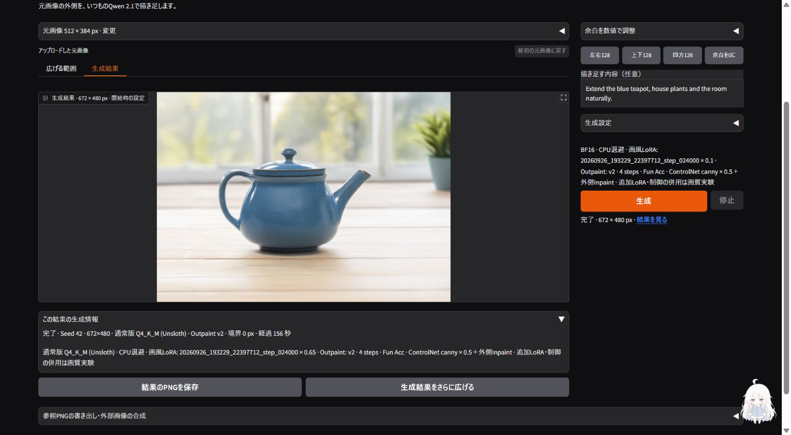
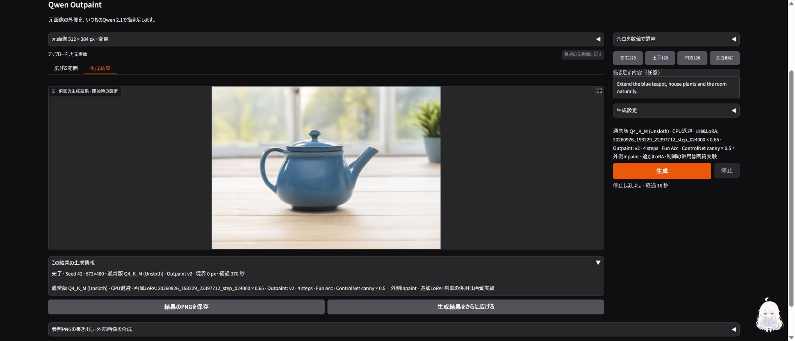

# Qwen Outpaint v3.5.0 実生成の証拠

2026-10-02、RTX 3090 24GB・RAM 64GB・CPU退避。通常版4精度はFun Acc＋Outpaint v2＋画風LoRA＋ControlNet、Turbo 2精度はFun Accなしの同じ追加アダプターで4 steps。元画像512×384から672×480、Seed 42、境界幅0です。

| ケース | 読み込み 秒 | 生成 秒 | 元画像RGBA |
|---|---:|---:|---|
| `base_q4_k_m-acc-style-control` | 478.664 | 146.391 | 全画素一致 |
| `int8-acc-style-control` | 686.787 | 175.921 | 全画素一致 |
| `w4a8-acc-style-control` | 1739.590 | 115.954 | 全画素一致 |
| `bf16-acc-style-control` | 513.694 | 505.505 | 全画素一致 |
| `turbo_q4_k_m-style-control` | 451.891 | 122.256 | 全画素一致 |
| `turbo_bf16-style-control` | 500.301 | 505.554 | 全画素一致 |
| `base_q4_k_m-acc-control-zero` | 422.846 | 110.039 | 全画素一致 |
| `base_q4_k_m-sparse-style` | 433.521 | 19.551 | 全画素一致 |

初回の変換・キャッシュ保存やキャッシュ状態が異なる単発実測です。速度・画質の順位は示しません。対応判定は適用層数・スケジューラ・実稼働・PNG保存・元画像保持で、画風や制御の質は別の評価です。元画像を合成して保持するため、画風の比較対象は追加領域です。

元画像、手製の制御画像、灰色余白の参照、外側マスク：

ローカルの絶対パスは省略・置換しています。モデル・LoRAの重みは同梱しません。

同条件の画風強度0では、適用された画風層は0でした。強度0.65との比較は、追加領域125952画素中113855画素が異なり、RGBの平均絶対差は3.179902です。元画像領域は両方で一致しました。差の大きさは画質の優劣を示しません。

固定Sparseのケースは通常版Q4・画風0.65・Outpaint v2、Fun Acc／ControlNet OFF、8 steps、保持率75%です。Sparse対象224回・dense32回のAttention呼び出しを記録し、元画像全画素一致で保存しました。4-stepの他ケースとは速度比較しません。

GUIでは、進行中に次回のモデル・強度をBF16・0.1へ変更しても、開始時のQ4・0.65で完成することを確認しました。同条件の2回目は読み込み済みモデルを再利用し、3回目は停止して前回結果を保持しました。保存ボタンのPNGも出力とSHA-256一致です。

停止画面の確認で発見した「生成中」ラベルの残存も修正し、再起動後に同条件の生成・停止を再実行しました。下の停止画面は修正後の最終UIです。

[GUI操作のタイムラプス（MP4）](timelapse.mp4) · [GIF](timelapse.gif) · 。修正と再起動を挟んだ約1,295秒の実画面28枚を34.4秒へ圧縮しています。生成途中の画像プレビューは作っていません。
