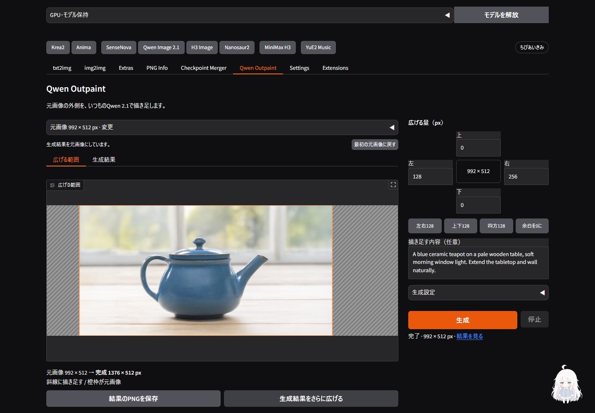

# Qwen OutpaintをForge内の生成へ統合 — 2026-09-27

Outpaintの「外部ComfyUIが必要」という制約は、前回の実装が参照準備と合成だけだったためです。既存Qwen Image 2.1のworkerへLoRAの読み込み・生成・合成を接続し、**元画像と余白を指定して「生成」を押すだけで完成PNGを得られる**形へ修正しました。v3.0.0の追加修正です。[操作手順](../../extensions-builtin/qwen-image21-studio/README.md#outpaint補助)

## 実装

- 通常のQwenタブと同じStudio・GPU所有権・resident workerを使用。通常版Q4_K_M／INT8に対応し、初期値はQ4_K_M・25 steps・CPU退避・Outpaint v2です。
- 初回だけ画面から追加LoRAを取得します。v1／v2は各159,436,576 bytes。取得元を固定revisionとSHA-256で検証し、壊れたファイルを導入済みにしません。既存モデルの量子化キャッシュは書き換えません。
- 開始時の元画像・余白・LoRA・境界幅をジョブ内へ保存。灰色参照を同じ寸法でQwenへ渡し、合成後の`output.png`を正規の完成画像として保存します。合成前も`output-generated.png`に残します。
- 元画像と余白から参照を再照合し、サイズや保存情報の不整合を生成前に拒否。境界幅0は元画像のRGBA全画素を保持します。32は拡張側の内縁だけを生成結果となじませます。
- モデル再利用の判定にLoRAの版とファイル情報を含め、通常生成へOutpaintの重みを持ち越しません。元画像へのlatent noise maskは使いません。
- 旧来の参照PNG書き出し・外部画像合成は折り畳み欄に残しました。通常の操作では開く必要がありません。

[作者のモデルカード](https://huggingface.co/ausboss/Qwen-Image-2.1-Outpaint-LoRA/blob/449336db42ff074aee970ba0facc0ac0feb77863/README.md)と[ComfyUIのQwen 2.1実装](https://github.com/Comfy-Org/ComfyUI/blob/master/comfy/ldm/qwen_image21/model.py)を2026-09-27に確認しました。配布LoRAの384テンソルを厳密に検査し、結合されたMLPのgate/upを分割してDiffusersの224層へ対応させます。rank=alpha=32で、量子化された本体の出力へ追加の低ランク計算を足します。実ファイルの数値照合では、結合・分割の差は0、追加計算は一致、本体重みは変更なしでした。

## 実生成

RTX 3090（24 GB）、固定Diffusers `6256aa7666cedd47443adc8f82da9a10e110b09c`、CFG 1、既存QwenのFlowMatch Euler、LoRA v2、25 steps。以前Qwenで生成した736×512の画像に、左右各128 pxを追加して992×512へ広げました。参照用リサイズもこの完成寸法と一致することを確認しています。

| 元画像 | Q4_K_Mで左右を拡張 |
| --- | --- |
|  |  |

| 検証 | INT8 | Q4_K_M |
| --- | --- | --- |
| 境界幅 | 0 px | 32 px |
| Seed | 3754468591355491302 | 2872163182818360273 |
| モデル読込 | 495.170秒 | 230.652秒 |
| 参照処理を含む生成 | 35.056秒 | 42.153秒 |
| worker全体 | 549.702秒 | 285.524秒 |
| 画素照合 | 元画像の全RGBA画素が一致 | 境界以外の元画像が一致。境界を含め規定の合成結果と全画素一致 |
| ブラウザー保存 | 完成PNGと全画素一致 | 完成PNGと全画素一致 |

読込条件、Seed、境界幅が異なる1回ずつの動作確認です。速度・画質の優劣を示す同条件ベンチマークではありません。[INT8の完成画像](../assets/qwen-native-outpaint/int8-v2.png)・[INT8照合記録](../assets/qwen-native-outpaint/int8-verification.json)・[Q4照合記録](../assets/qwen-native-outpaint/q4-verification.json)

## 操作と回帰検証

- Chromeの実画面から生成・完成PNG保存を実行。Q4_K_Mの再生成ではモデルの再利用を確認し、途中で「停止」。停止後にworker終了を確認し、成功扱いの`result.json`は残りません。前回の完成画像とダウンロードは保持され、保存PNGも停止前と全画素一致でした。
- 未導入のv1へ切り替えると準備ボタンが現れ、画面から取得・SHA-256検証が完了すると消えることを確認。準備済みv2への切替でも適切に非表示になります。
- 1440×1000・390×844で操作確認。モバイル幅で横方向のはみ出しなし。LoRAを切り替えても実行中ジョブは開始時のv2を保持。最終の操作確認でアプリのJavaScript例外は0件でした。検証サーバー再起動中の接続失敗と、旧Gradio由来のSSE警告は別途記録しています。
- Qwen関連214テスト: OK（7スキップ）。全体CPU回帰1,809テスト: OK（52スキップ、既知の期待失敗1）。追加テストには元画像の独立保存、RGBA保持、改変された参照・余白の拒否、未対応の組合せ、破損ダウンロード、正規出力と生の生成画像の分離、所有者の境界を含みます。
- CI対象151ファイルのRuff check／format検査、および追加UI・セットアップスクリプトの検査を通過。v3.0.0より前のCHANGELOG本文が変更されていないことも照合しました。

実GPU生成はLoRA v2の上記2構成です。v1は画面からの導入、SHA-256検証、384テンソルから224層への対応確認までで、GPU生成は未実施です。W4A8・BF16・Turbo、Fun Acc・ControlNet・Sparseとの組合せは受け付けません。大きなキャンバス、多様な被写体、透過素材の生成品質の評価は今回の範囲に含めません。通常のQwen生成機能は維持しています。

## ネイティブ生成に合わせた画面の再設計

元画像・範囲・設定を同じ大きさで並べる3列構成から、大きな画像領域と余白設定の2列へ変更しました。元画像の選択後は範囲プレビューを表示し、生成完了時は同じ場所が結果へ切り替わります。

- **範囲の指定:** 上・左・右・下の数値欄を元画像の周りに配置。左右128／上下128／四方128は4辺をまとめて置き換えるショートカットです。元画像寸法→完成寸法と、32 px単位へ合わせる調整量を表示します。
- **画像の基準:** 「生成結果をさらに広げる」は最後にこの画面へ表示した成功ジョブを参照し、所有者を検査して正規PNGを読みます。画像コンポーネントの縮小プレビューは使いません。余白と説明を残して元画像を置き換え、生成は自動では始めません。「アップロードした元画像／生成結果」の表示で現在の基準を区別できます。「最初の元画像に戻す」は位置を固定し、再拡張後に有効になります。
- **反復利用:** 結果の保存・再拡張は範囲の調整中も操作できます。前回の結果は設定変更や停止で失われません。出力ファイル名には寸法とジョブIDを付けました。
- **普段使わない設定:** LoRA、Qwenの量子化、境界幅、Seedは「生成設定」へ。準備済みの説明は削除し、初回取得が必要な場合だけ準備ボタンを表示します。結果のSeed等は「この結果の生成情報」にまとめています。
- **狭い画面:** 生成・停止と状態表示を下部に固定。「結果を見る」で画像領域へ移動できます。入力欄へフォーカスすると固定バーに隠れない位置へ移動します。

[390px幅で余白を指定する画面](../assets/qwen-native-outpaint/mobile-controls.png)

### 相談と判断

ネイティブ接続の実装時にはOAuth更新エラーでOpusの回答を得られませんでした。その後ユーザーが再ログインし、画面再設計では **Claude Opus 5.5（`claude-opus-5-5`、指定effort `medium`）から2回の回答**を取得しました。1回目は旧画面3枚と実生成の制約を渡した方向性の相談、2回目は改修後の実Chrome画面4枚によるレビューです。両方とも回答モデルを確認しています。コードの実装・操作検証はCodexが担当しました。

大きな作業領域、十字の余白入力、数値ショートカット、結果からの再拡張を採用。追加レビューで指摘された「何を基準に広げるのか」の混同に対して、元画像寸法をプレビューと数値欄の中央へ表示し、再拡張ボタンを結果タブ以外でも使える位置へ移しました。画像を選ぶ前の空タブも非表示にしています。

最終幅・高さと余白の二重指定、ドラッグ専用操作、履歴一覧は今回追加していません。範囲調整の入力を4辺の数値に統一し、既存の自由入力を維持しました。Opusが懸念した別ブラウザーの結果との混同については、成功ジョブIDがGradioのセッションごとの状態であり、画像取得時にも所有者を検査することをコードで確認しています。

### 追加の確認範囲

- Qwen関連219テスト成功（7スキップ）。最終のUIコールバック・画像保持等62テストも成功。Ruffの検査とJavaScript構文検査を通過。
- 実Chromeの1440×1000と390×844で入力・数値ショートカット・無効化・復帰を確認。余白0と約2 MP超過で生成を無効化し、32 px補正の増分を表示。Tabキーの順は上→左→右→下と画面配置に対応しています。
- 改修画面からQ4_K_M／v2／25 stepsで実生成。生成中に余白を変えても開始時の992×512を維持し、自動で結果を表示。ダウンロード画像は正規PNGと全画素一致しました。[照合記録](../assets/qwen-native-outpaint/ui-verification.json)
- 最終画面で736×512の元画像→992×512の生成→結果を元画像へ→元画像へ戻す→結果を再び元画像へ→1376×512の再生成まで完了。最初の再拡張から「戻す」が有効になり、戻した後は無効になります。境界幅0の2回とも元画像領域の全RGBA画素を保持し、2回目の参照元は1回目の完成PNGと全画素一致。2回ともブラウザー保存と正規PNGを照合しました。[連続生成の照合記録](../assets/qwen-native-outpaint/continuation-verification.json)
- その後の生成を画面から停止し、約5秒で停止完了の表示に復帰。直前の1376×512の結果は保存・再拡張が可能で、停止後に保存したPNGも停止前の完成画像と全画素一致しました。
- 狭い画面の「結果を見る」で結果が表示範囲へ移動し、PNG保存と再拡張を操作できます。通常のQwenタブへ移動するとOutpaintの固定操作欄が非表示になり、戻ると結果が保持されます。[390px幅の生成結果](../assets/qwen-native-outpaint/mobile-result.png)

この追加検証はローカルChromeのデスクトップと狭い表示幅で行っています。スマートフォン実機のソフトウェアキーボードと第三者による初見テストは未実施です。最終画面の操作中のJavaScript例外は0件で、検証サーバー再起動中の接続エラーとGradio由来の警告は区別しています。前回のUI実装・レビューは[初回のv3レビュー記録](2026-09-27-v3-ui-ux.md)に残しています。
