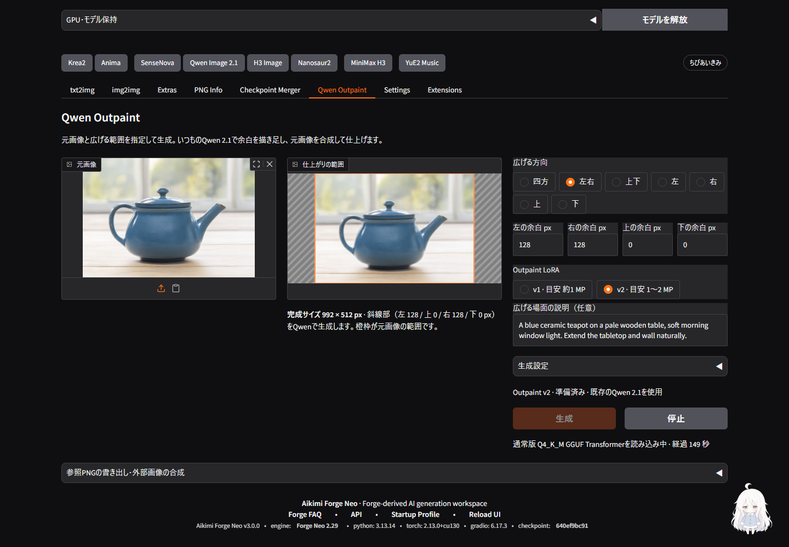
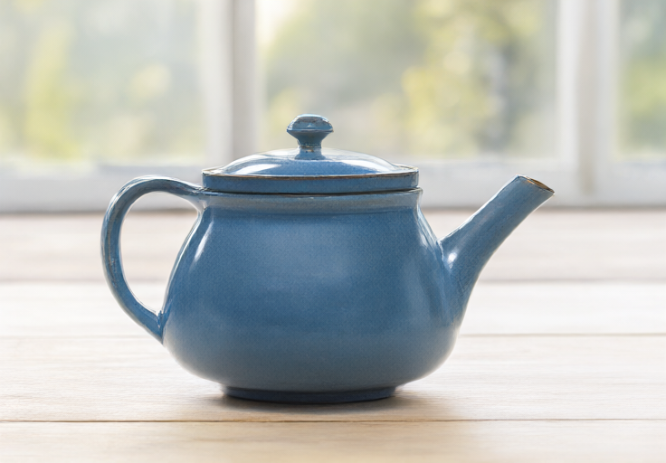
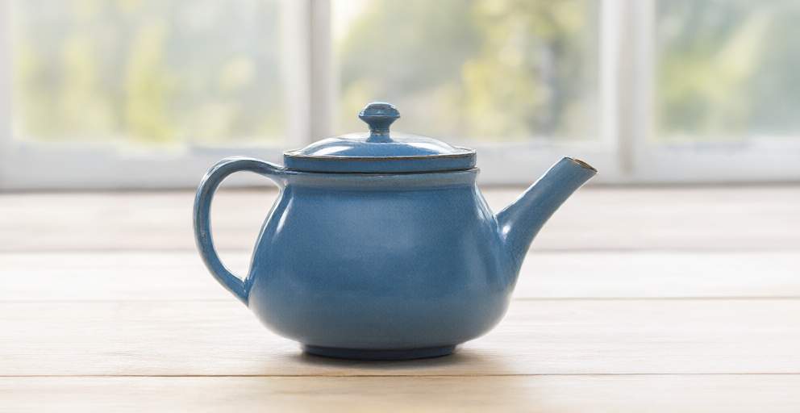

# Qwen OutpaintをForge内の生成へ統合 — 2026-09-27

Outpaintの「外部ComfyUIが必要」という制約は、前回の実装が参照準備と合成だけだったためです。既存Qwen Image 2.1のworkerへLoRAの読み込み・生成・合成を接続し、**元画像と余白を指定して「生成」を押すだけで完成PNGを得られる**形へ修正しました。v3.0.0の追加修正です。[操作手順](../../extensions-builtin/qwen-image21-studio/README.md#outpaint補助)

## 実装

- 通常のQwenタブと同じStudio・GPU所有権・resident workerを使用。通常版Q4_K_M／INT8に対応し、初期値はQ4_K_M・25 steps・CPU退避・Outpaint v2です。
- 初回だけ画面から追加LoRAを取得します。v1／v2は各159,436,576 bytes。取得元を固定revisionとSHA-256で検証し、壊れたファイルを導入済みにしません。既存モデルの量子化キャッシュは書き換えません。
- 開始時の元画像・余白・LoRA・境界幅をジョブ内へ保存。灰色参照を同じ寸法でQwenへ渡し、合成後の`output.png`を正規の完成画像として保存します。合成前も`output-generated.png`に残します。
- 元画像と余白から参照を再照合し、サイズや保存情報の不整合を生成前に拒否。境界幅0は元画像のRGBA全画素を保持します。32は拡張側の内縁だけを生成結果となじませます。
- モデル再利用の判定にLoRAの版とファイル情報を含め、通常生成へOutpaintの重みを持ち越しません。元画像へのlatent noise maskは使いません。
- 旧来の参照PNG書き出し・外部画像合成は折り畳み欄に残しました。通常の操作では開く必要がありません。

[作者のモデルカード](https://huggingface.co/ausboss/Qwen-Image-2.1-Outpaint-LoRA/blob/449336db42ff074aee970ba0facc0ac0feb77863/README.md)と[ComfyUIのQwen 2.1実装](https://github.com/Comfy-Org/ComfyUI/blob/master/comfy/ldm/qwen_image21/model.py)を2026-09-27に確認しました。配布LoRAの384テンソルを厳密に検査し、結合されたMLPのgate/upを分割してDiffusersの224層へ対応させます。rank=alpha=32で、量子化された本体の出力へ追加の低ランク計算を足します。実ファイルの数値照合では、結合・分割の差は0、追加計算は一致、本体重みは変更なしでした。

## 実生成

RTX 3090（24 GB）、固定Diffusers `6256aa7666cedd47443adc8f82da9a10e110b09c`、CFG 1、既存QwenのFlowMatch Euler、LoRA v2、25 steps。以前Qwenで生成した736×512の画像に、左右各128 pxを追加して992×512へ広げました。参照用リサイズもこの完成寸法と一致することを確認しています。

| 元画像 | Q4_K_Mで左右を拡張 |
| --- | --- |
|  |  |

| 検証 | INT8 | Q4_K_M |
| --- | --- | --- |
| 境界幅 | 0 px | 32 px |
| Seed | 3754468591355491302 | 2872163182818360273 |
| モデル読込 | 495.170秒 | 230.652秒 |
| 参照処理を含む生成 | 35.056秒 | 42.153秒 |
| worker全体 | 549.702秒 | 285.524秒 |
| 画素照合 | 元画像の全RGBA画素が一致 | 境界以外の元画像が一致。境界を含め規定の合成結果と全画素一致 |
| ブラウザー保存 | 完成PNGと全画素一致 | 完成PNGと全画素一致 |

読込条件、Seed、境界幅が異なる1回ずつの動作確認です。速度・画質の優劣を示す同条件ベンチマークではありません。[INT8の完成画像](../assets/qwen-native-outpaint/int8-v2.png)・[INT8照合記録](../assets/qwen-native-outpaint/int8-verification.json)・[Q4照合記録](../assets/qwen-native-outpaint/q4-verification.json)

## 操作と回帰検証

- Chromeの実画面から生成・完成PNG保存を実行。Q4_K_Mの再生成ではモデルの再利用を確認し、途中で「停止」。停止後にworker終了を確認し、成功扱いの`result.json`は残りません。前回の完成画像とダウンロードは保持され、保存PNGも停止前と全画素一致でした。
- 未導入のv1へ切り替えると準備ボタンが現れ、画面から取得・SHA-256検証が完了すると消えることを確認。準備済みv2への切替でも適切に非表示になります。
- 1440×1000・390×844で操作確認。モバイル幅で横方向のはみ出しなし。LoRAを切り替えても実行中ジョブは開始時のv2を保持。最終の操作確認でアプリのJavaScript例外は0件でした。検証サーバー再起動中の接続失敗と、旧Gradio由来のSSE警告は別途記録しています。
- Qwen関連214テスト: OK（7スキップ）。全体CPU回帰1,809テスト: OK（52スキップ、既知の期待失敗1）。追加テストには元画像の独立保存、RGBA保持、改変された参照・余白の拒否、未対応の組合せ、破損ダウンロード、正規出力と生の生成画像の分離、所有者の境界を含みます。
- CI対象151ファイルのRuff check／format検査、および追加UI・セットアップスクリプトの検査を通過。v3.0.0より前のCHANGELOG本文が変更されていないことも照合しました。

実GPU生成はLoRA v2の上記2構成です。v1は画面からの導入、SHA-256検証、384テンソルから224層への対応確認までで、GPU生成は未実施です。W4A8・BF16・Turbo、Fun Acc・ControlNet・Sparseとの組合せは受け付けません。大きなキャンバス、多様な被写体、透過素材の生成品質の評価は今回の範囲に含めません。通常のQwen生成機能は維持しています。

今回もOpus 5.5への追加相談を試みましたが、Claude側のOAuth更新エラーで回答を取得できませんでした。前回のUI実装・レビューは[初回のv3レビュー記録](2026-09-27-v3-ui-ux.md)に残しています。今回のネイティブ接続と上記検証はCodexが実施しました。
