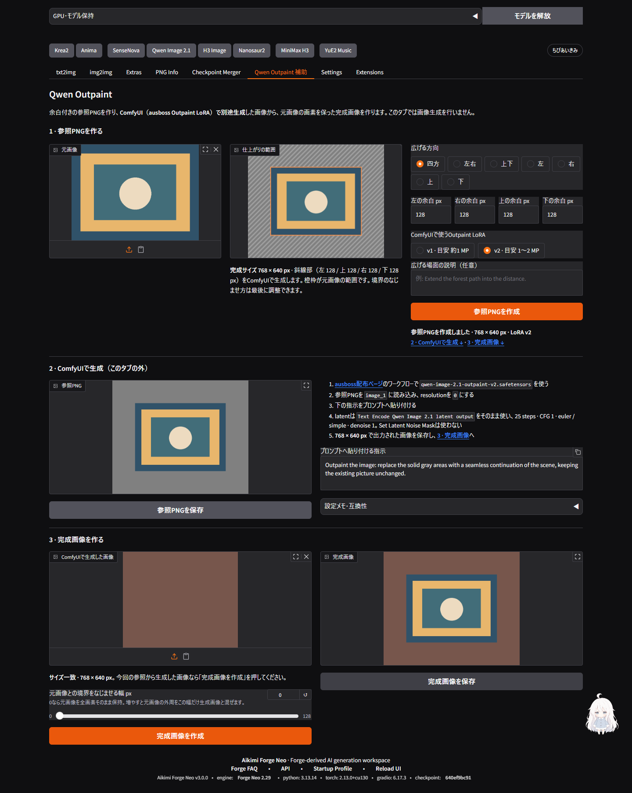
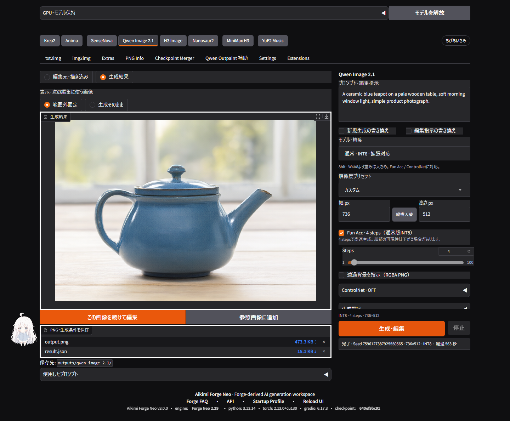

# v3.0.0 UI・UXの変更と検証

確認日: 2026-09-27。Windows / Python 3.13.14 / Gradio 6.17.3 / Chrome / RTX 3090（24GB）。

Pro側のOutpaint関連5コミットを、`287cd903cd525c3d0b7797611d743d9f84b4ab23`まで取り込みました。その上で既存Studioの操作を改善しています。Claude Opus 5.5へ実画面を渡し、実装と実装後のレビューを依頼しました。Outpaintの方向選択・プレビュー・保存導線はOpusの実装を基に統合し、Forgeとの互換性、入力変更時の状態、保存画像はローカルで検証・修正しています。

## 変えた操作

| 対象 | 変更 |
|---|---|
| Qwen・SenseNova・H3動画 | プリセットに加えて幅／高さを直接入力。手入力はカスタムへ切り替え、縦横入替に対応。無効な寸法は黙って丸めず理由を表示。 |
| H3 Image・Nanosaur2 | 既存の自由入力に縦横入替を追加。 |
| Qwenモデル | 通常版をQ4_K_M → W4A8 → INT8 → BF16の順に整理。選択した形式の重みの軽さとFun Acc／ControlNetへの対応を表示。速度や必要VRAMの順位とは区別。 |
| Qwen編集画面 | 空の参照欄を縮小。設定内部の二重スクロールを解消。生成結果と描き込みを切り替え、保存・次の編集へ進める配置に変更。狭い画面では入力欄が生成バーに隠れないよう調整。 |
| Outpaint | 「参照PNGを作る → ComfyUIで生成 → 完成画像を作る」の3段階。広げる方向、完成寸法、元画像と追加範囲のプレビュー、寸法付きPNG保存を追加。 |
| SenseNova | 生成ボタンと設定の重なりを修正。公式8-Stepの復元値を8 steps・CFG 1へ同期。空のプロンプトは入力途中として扱い、送信時には検証。 |
| H3動画 | プロンプト補助を入力欄の近くへ、寸法・時間・負荷と生成操作を詳細設定より前へ移動。履歴・ワークフローへカスタム寸法を保存。 |
| 共通部分 | H3 Image・Nanosaur2・YuE2を共通ナビゲーションへ追加。Studio独自のモデルとForge本体の選択表示を分離。保存済みモデル・補助モジュール、ControlNet初期値、H3未起動時の表示を修正。 |

OutpaintはCPUで準備・合成する補助です。**LoRAを使った画像生成は外部ComfyUIで行います。** 元画像と同じ寸法のファイルでも、本当に今回の参照から生成されたかまでは判定できません。条件変更時は合成を止め、前回の参照・完成画像をその旨の表示で残します。入力を元に戻せば前回の生成画像を使えます。



このOutpaint画面の画像は画素照合用の図形と単色画像です。LoRAの生成作例ではありません。

## 実施した検証

- CPU・オフラインの全体スイート: **1,794件、成功終了**。52件スキップ、既知の期待失敗1件を含みます。
- H3ワークフロー・Union 2.0のpytest: **89件＋19 subtests通過**。JavaScriptのワークフロー変換: **15件通過**。
- YuE2のpytest: **44件通過・5件スキップ**。Jev／Sparse Attentionのpytest: **245件通過**。いずれもモデル取得や外部API呼び出しを行わないCI設定です。
- 全体スイート後のSenseNova・寸法・CSS最終調整: 関連**37件通過**。H3の関連**22件**と、カスタム履歴から寸法・選択肢ラベルを復元するコールバックも確認。
- 今回変更したCI対象Pythonと新規ヘルパー等13ファイルのRuff check／format check、変更したJavaScriptの構文、`git diff --check`を確認。
- 実Gradio・Chromiumで2回のQwen生成完了を模擬し、PNG／JSONの実取得、生成結果からの再編集、描画の入力、前の画像の描画がUndoで復活しないことを確認。Fun Acc切替とControlNetの表示も確認。
- 実Forge画面でQwen・SenseNova・H3の736×1120入力と縦横入替、H3 Image・Nanosaur2の704×1024入力と入替を確認。SenseNovaの参照基準サイズへの切替は手入力値を保持し、数値欄と入替を無効化。H3はカスタムから通常プリセットへ戻ると寸法とアスペクト比操作が復帰。
- 1440×1000、390×844で表示を確認。Qwen・SenseNova・H3・Outpaintの横方向のはみ出しなし。390×450でもQwenの数値入力欄が生成バーより上に表示されることを確認。これは縮小ビューポートでの検証で、実機ソフトウェアキーボードの検証ではありません。
- Outpaintの方向選択・手入力同期、サイズ不一致、入力変更・元値への復帰、同一条件の再準備、PNG保存をChromeで確認。保存した参照PNGは灰色余白がRGB `(128,128,128)`、元領域が全画素一致。境界幅0の完成PNGも元領域が全画素一致し、追加領域は入力した生成画像と一致。

テスト用の最初のタブもForge同様に入力欄を持たせ、部品の初期描画を待つようにしました。Markdownだけの簡易タブでは、Gradio 6.17.3が後続の折りたたみ内のForm部品を表示できない場合がありました。実画面での動作と、テスト用構成の問題を分けて修正しています。

## 実GPUによる自由サイズ生成

Forgeの検証用画面から、Qwenの実workerへ生成を送信しました。画面は`--ui-debug-mode`で起動していますが、Qwenの追加Studioは実モデル・実GPUを使用しています。

| 条件 | 記録 |
|---|---|
| 入力サイズ／保存PNG | **736×512**（手入力した値と一致） |
| モデル | 通常版INT8、Fun Acc 4 steps、CPU offload |
| プロンプト | A ceramic blue teapot on a pale wooden table, soft morning window light, simple product photograph. |
| Seed | `7596127387925550565` |
| 時間 | モデル読み込み512.157秒、sampling 18.059秒、worker全体560.879秒 |
| PNG SHA-256 | `e6851140820ef7a3b9394491eebc44a66925b169daf87634fee2c4d3059c78d5` |



時間はこの環境での単発の確認値であり、モデル間の速度比較ではありません。

## 今回確認していない範囲

Outpaint LoRAによる外部ComfyUIでの実生成、全量子化形式の同条件比較、H3のカスタム寸法での実動画生成、SenseNova・H3 Image・Nanosaur2の今回の寸法での実GPU生成は未実施です。H3の寸法はリクエスト・ワークフロー・履歴復元と実画面まで確認しています。既存の実生成記録は各機能ガイドに残しています。

## 再実行

依存関係は既存の`requirements.txt`とブラウザテスト用の`tools/requirements-test.txt`を使用します。Windowsでリポジトリのvenvを使う例です。

```powershell
venv\Scripts\python.exe -X utf8 tools/run_ci_tests.py --verbosity 1
venv\Scripts\python.exe -X utf8 tools/run_ci_tests.py --pytest tools/tests/test_h3_handoff_store.py tools/tests/test_h3_handoff_runtime_pack.py tools/tests/test_h3_handoff_integration.py tools/tests/test_h3_union2_vae.py tools/tests/test_h3_union2_installers.py -q
node --test tools/tests/h3_handoff_core.test.mjs
```

通常の利用は`aikimi-launch.bat`から起動します。[Outpaintの操作手順](../../extensions-builtin/qwen-image21-studio/README.md#outpaint補助)と[変更履歴](../../CHANGELOG.md)を参照してください。
