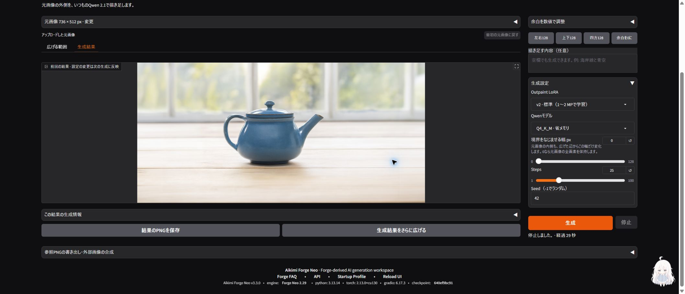

# v3.4.0 Qwen Outpaint GUIの再検証

確認日：2026-10-02。Windows・RTX 3090 24 GB・Chromeで、実際の画面操作から生成・保存・再拡張・停止まで確認しました。

## 修正した不具合

- 元画像を半画素相当だけ動かすと、左右・上下の余白が別々に丸められ、完成寸法が32 px増えるケースを再現。移動量を1回だけ整数化し、左右・上下の合計を保持するように修正しました。
- 32 pxへの寸法調整で追加された余白まで元画像を移動できるようにしました。キーボードも同じ範囲を使用し、ドラッグのキャンセルでは調整前の入力を復元します。
- Gradioが同じ値のHTMLを再利用した場合も、枠・寸法を初期描画するようにしました。

上記5ケースは実際のキャンバスJavaScriptをNode VMで実行する回帰テストに追加しました。修正前は3件失敗、修正後は5件成功。CIでも実行します。

## 画面操作

Qwenを開く前は「画像生成／画像を広げる」を隠し、Qwenを押すと表示。他の機能へ移ると隠れ、戻ったときにOutpaintの元画像と余白を保持しました。

辺のドラッグ、元画像の移動、1:1プリセット、全体拡張、リセット、4辺の数値入力が同期しました。余白0では生成を無効化し、有効な余白へ戻すと再度有効化。上限超過の864×4672 pxも生成を無効化しました。狭い画面（実測CSS幅487 px）ではタッチで右辺を広げ、元画像を動かしても完成寸法1056×512 pxを保持。検証後はブラウザーの寸法指定を解除しました。

## GPU実生成

共通条件は通常版Q4_K_M、CPU退避、Outpaint LoRA v2、25 steps、Seed 42、境界幅0、描き足す内容は空欄です。

| 操作 | 元画像 → 完成寸法 | 左・上・右・下の余白 | モデル読込 | 生成処理 |
|---|---|---|---|---|
| 4辺を拡張 | 736×512 → 1184×704 | 192 / 64 / 256 / 128 px | 314.929秒 | 50.748秒 |
| 完成画像をさらに拡張 | 1184×704 → 1440×704 | 128 / 0 / 128 / 0 px | 0秒（再利用） | 54.195秒 |

両方で、元画像のRGBA全画素が配置先に完全一致すること、保存PNGが生成後の合成処理と一致すること、ブラウザーから保存したPNGがジョブ出力と一致することを確認しました。2回目は1回目の完成PNG全体が次の元画像です。

「最初の元画像に戻す」で736×512へ復帰後、3回目を開始し、実際のサンプリング中（17〜19/25 step）に停止しました。ジョブは`cancelled`となり、完成PNGを書きませんでした。前回の1440×704 PNGは画面とファイルの両方で保持し、保存・再拡張・次の生成が有効、停止ボタンが無効になることを確認しました。終了後にモデルを解放し、Qwenワーカープロセスが残っていないことを確認しました。最終コンソール確認ではエラー0件でした。

## 記録と再確認

- [操作・進行表示・生成結果のタイムラプス（MP4）](../assets/qwen-outpaint-v3.4.0/timelapse.mp4) · [GIF](../assets/qwen-outpaint-v3.4.0/timelapse.gif) · [各フレームの時刻と操作](../assets/qwen-outpaint-v3.4.0/timelapse-frames.json)
- [元画像](../assets/qwen-outpaint-v3.4.0/source.png) · [1回目の完成PNG](../assets/qwen-outpaint-v3.4.0/pass-1.png) · [再拡張の完成PNG](../assets/qwen-outpaint-v3.4.0/pass-2.png)
- [停止後の前回結果](../assets/qwen-outpaint-v3.4.0/stop-preserves-result.png) · [狭い画面のタッチ検証](../assets/qwen-outpaint-v3.4.0/narrow-touch.png) · [生成条件・ハッシュ・確認結果](../assets/qwen-outpaint-v3.4.0/verification.json)
- [バージョン更新・再起動後のv3.4.0画面](../assets/qwen-outpaint-v3.4.0/release-ui.png)。生成テストと動画収録の後にバージョンを更新したため、収録中のフッターはv3.3.0です。
- [以前の3画像・LoRAなし／v2比較](../assets/qwen-outpaint-comparison/README.md)

QwenのPythonテスト262件は254成功・8スキップ、関連機能の絞り込み95件は成功。NodeのH3・Outpaint契約テスト20件、変更PythonのRuff検査・フォーマット確認も成功しました。Pythonの件数は重複するため合算しません。

```powershell
venv/Scripts/python.exe -m unittest tools.tests.test_aikimi_tabs tools.tests.test_ci_workflow_boundaries tools.tests.test_qwen_image21_outpaint tools.tests.test_qwen_image21_outpaint_gui
node --test tools/tests/h3_handoff_core.test.mjs tools/tests/qwen_outpaint_canvas.test.mjs
```

今回の新しいGUI実生成はQ4_K_M＋Outpaint v2を対象にしています。INT8・v1の新GUI実生成、実機スマートフォンは未検証です。動画は実操作と進行表示のスクリーンショットを時系列に並べ、待機時間を短縮した記録です。拡散途中の画像を生成する機能は追加していません。


