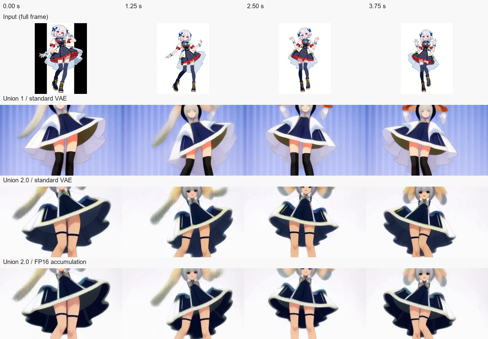

# MiniMax H3 Union 1／2.0・VAEの実機比較（2026-09-24）

## 結論と選び方

Canny制御だけなら、重みが約2.14 GiBのUnion 1を第一候補にします。Union 2.0のINT8重みは約4.22 GiB（1.97倍）で、今回の短い4 Steps試験だけでは追加容量に見合う一貫した画質改善や速度改善を確認できませんでした。Gray、Depth、PoseなどUnion 2.0の追加制御方式を使うときに任意導入してください。どちらの重みもリポジトリに含まず、Union 2.0は通常セットアップで自動取得しません。

今回のRTX 3090実機では、更新したComfyUIでComfy Compilerを有効にしたUnion 2.0が最初のStep（0/4）から25分以上進まなかったため、安全にキャンセルしました。同じ設定でCompilerを無効にすると音声付き動画が完成しました。この1件だけでCompilerが原因と断定はできません。H3 Studioに明示的なON/OFFと起動引数の照合を追加したので、同じ症状のときはOFFを選び、専用runtimeを再起動できます。

## 測定条件

- GPU: NVIDIA GeForce RTX 3090（24 GiB）、driver 610.74。Windows、Python 3.12.13。
- H3専用ComfyUI 0.37.0、revision `912fca4f39b875a0360f2c5170568176ea813ded`、comfy-kitchen 0.2.35、comfy-aimdo 0.5.5。
- FL2VA標準INT8 ConvRot DiT、標準FP16 video VAE、同じQwen3-VL encoder、`low_ram` profile、Comfy Kitchen dense、Compiler OFF。同じプロンプト・入力動画・Seed `20260924`を使用。
- 5秒、124 frames、24 fps、608×352（`draft`）、4 Steps。元動画は544×736・24 fps・10秒のアニメ調ダンス動画で、中央で横長に切り抜いてCanny制御。音声は入力から使わず生成。4 Stepsは導通確認用で、通常の20 Stepsの画質を代表しません。
- Union 1とUnion 2.0はそれぞれのINT8制御重みを使用。VAEの比較設定`fp16_accumulation`はComfyUI起動引数`--fast fp16_accumulation`を使うため、VAEデコードだけに作用する単独の処理ではありません。
- 各条件1回。cold startを含むジョブ所要時間と、3秒ごとの`nvidia-smi`で測ったGPU全体の使用メモリ最大値です。GPUには他プロセスの使用量も含まれ、測定順と初期化・キャッシュの影響を分離できません。

| 条件 | 制御重み | ジョブ時間 | GPU使用量の最大 | 結果 |
| --- | ---: | ---: | ---: | --- |
| Union 1・標準VAE | 2,296,635,360 bytes（2.14 GiB） | 1,115秒 | 23,944 MiB | MP4／音声完成 |
| Union 2.0・標準VAE | 4,531,220,608 bytes（4.22 GiB） | 1,005秒 | 23,725 MiB | MP4／音声完成 |
| Union 2.0・FP16積算 | 同上 | 1,115秒 | 23,623 MiB | MP4／音声完成 |

完成した3本は共に608×352、124 frames、24 fps、32 kHz stereoです。各条件でほぼ24 GiBのVRAMを使用しました。Union 2.0の標準設定はUnion 1より単発では約110秒速く、FP16積算よりも約110秒速く終わりましたが、初回モデル準備は各条件で約8〜9分かかっています。測定順、初期化、キャッシュの影響を分離できないため、安定した速度差とみなしません。

## 映像の確認

3本とも入力動画のダンスの大まかな動きに沿う人物を描きました。Union 2.0はこの試験では白い背景と顔の描画が比較的残り、Union 1は青い背景になりました。Union 2.0のFP16積算は標準設定と似た構図で細部が変わり、明確な改善は見いだせませんでした。一方、3本とも髪・衣装・手足が元動画から変化し、中央切り抜きによって頭部と脚部もフレーム外に出ます。4 Stepsの粗い出力から一般的な画質優位は判断しません。

同じ時点（0、1.25、2.5、3.75秒）のフレームを以下に並べました。最上段だけ元動画を全画面で表示しており、生成条件に入るときは中央で横長に切り抜かれます。生成結果の動画本体は`outputs/minimax_h3/union2_vae_compare_no_compiler_20260924/`にローカル保存し、リポジトリには含めていません。



## 再実行

モデルと専用runtimeを導入後、リポジトリのルートから実行します。入力動画は任意の5秒以上の手元のMP4に置き換えてください。実行ごとのJSON、動画、生成条件、ComfyUIワークフロー記録は指定したローカル出力先へ保存されます。

```powershell
venv\Scripts\python.exe tools\benchmark_h3_union2_vae.py --control-video "H:\path\to\input.mp4" --output outputs\minimax_h3\union2_vae_compare --cases union1 union2 union2_fp16 --quality draft --steps 4 --profile low_ram --diagnostic-no-compiler
```

Compiler ONで進まない事例は[ComfyUI issue #16230](https://github.com/comfy-org/ComfyUI/issues/16230)にも報告されています。今回の測定と環境が同じとは限らないため、原因の特定や一般的な回避効果の証明には使っていません。
