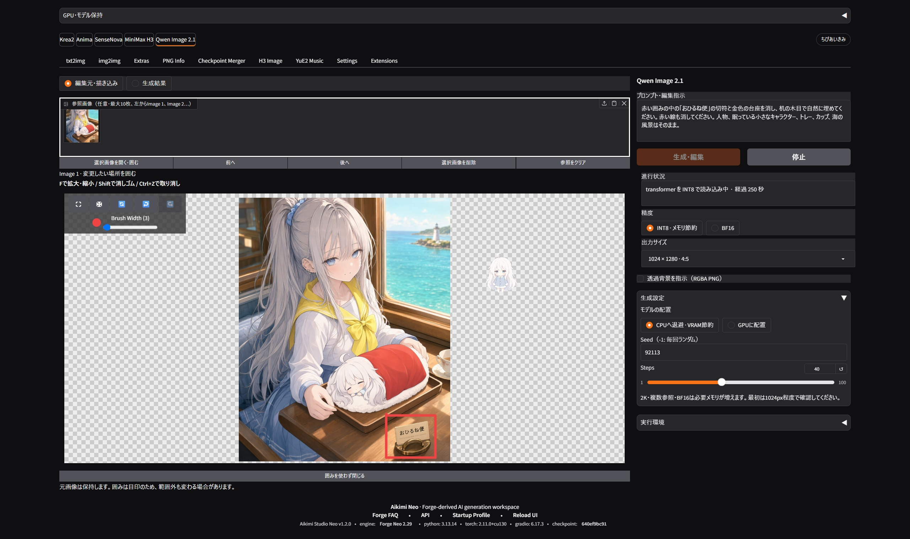
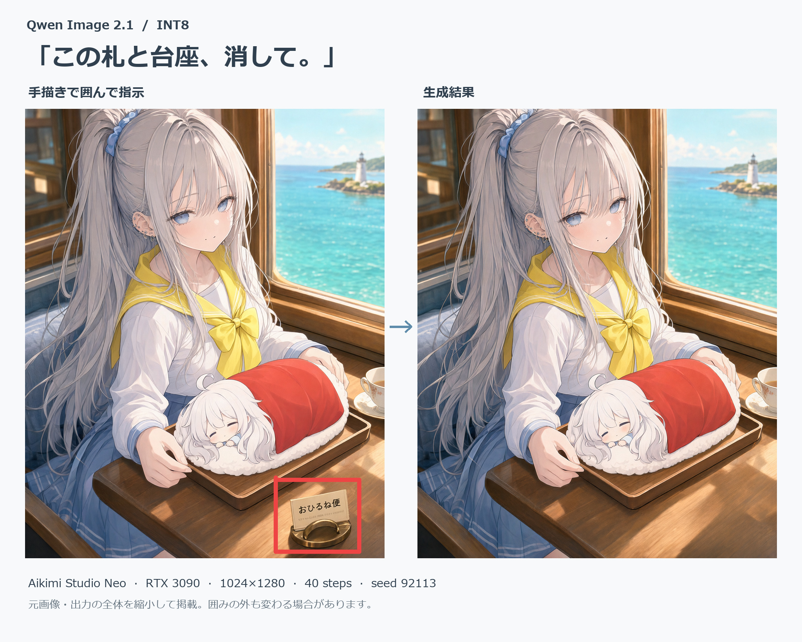
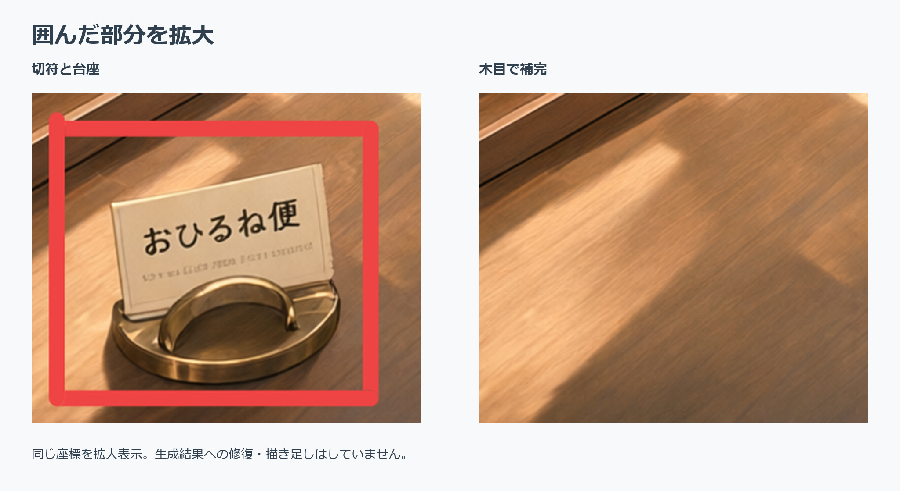

# Qwen Image 2.1をAikimi Forge Neoに実装しました

画像を作ったあと、机の上の小物だけ消したくなることがあります。今回は「おひるね便」と書かれた切符と台座を消してみました。

Aikimi Forge Neoに追加した**Qwen Image 2.1専用タブ**の実画面と出力を見ながら、操作の流れと、使って分かった限界を紹介します。

## 赤く囲んだ切符と台座を消してみる

元画像は、海を望む室内で銀髪の人物が小さなキャラクターを抱くイラストです。机の右下にある「おひるね便」の切符と金色の台座を取り除きます。

上部の「Qwen Image 2.1」タブを開き、元画像を参照画像として読み込みます。1枚なら描画欄が開くので、消したい切符と台座を赤いペンで囲みました。

右側のプロンプト欄には、日本語で「赤い囲みの中の『おひるね便』の切符と金色の台座を消し、机の木目で自然に埋めてください」と入力。人物、眠っている子、トレー、カップ、海を残す指示も添えます。

*2026年9月21日の実画面。左で編集箇所を囲み、右で指示と設定を確認します。スクリーンショットはモデル読み込み中の状態です。*

今回の検証設定は、**INT8・CPU退避・1024×1280・40 steps・Seed 92113**。

「生成・編集」を押すとモデルの読み込みが始まります。この回の約858秒（約14分）は、保存済みINT8モデルの再読込ではなく、公式重みからINT8に変換しながら読み込んだ時間です。続く画像生成処理は約96秒。モデルをメモリに保持して同じ条件で再実行したときは、モデルの再読込なしで生成処理が約92秒でした。

変換後のモデルをディスクに保存しても、次回起動後は読み込みが必要です。保存済みINT8モデルを読み込んだ別の試行では約448秒かかりました。変換処理を省ける一方、待ち時間がゼロにはなりません。いずれもWindows 11、RTX 3090（24GB）での実測で、保存先や環境によって変わります。

*左が赤枠を描いた入力、右がモデルの出力。比較用の台紙を付け、両画像を縮小して並べています。生成された部分には加筆していません。*

切符と台座は消え、机の木目で埋まりました。生成部分への加筆や修正はしていません。

*同じ座標を拡大した比較。右側の木目はQwen Image 2.1の生成結果です。*

同じ座標を拡大すると、木目と机上の光のつながりを確認できます。この画像では目立つ境界は見当たりません。

赤い囲みは、モデルに「ここを直したい」と伝える**注釈**です。人物や背景の雰囲気は保たれましたが、囲みの外側まで元画像と同じ画素になるわけではありません。髪や衣服の細部を比べると、描き直しも見つかります。

結果を見てもう一箇所変えたくなったら、「この画像を続けて編集」で、その画像を次の編集元にできます。

## 背景を画素単位で残したいなら、マスクを使う

囲みの外を元画像の画素のまま残したい場合は、**「マスク範囲外を元画像に固定」**を使います。

変更したい部分をマスクで塗り、生成後にその部分だけを元画像へ合成する仕組みです。位置を伝える囲み注釈と併用できますが、役割は異なります。

別の実例では、ロボットの横の赤いカップだけを青くしました。編集元と出力を同じ1024×1024にし、カップを含む領域をマスク。PE-I2Iの指示補助をONにして、W4A8・CPU退避・40 stepsで1回生成しています。

*編集元。これは同じタブで生成した画像です。*

*モデルの出力そのまま。カップは青くなりましたが、ロボットや背景の細部にも変化があります。*

*マスク外を固定した出力。カップ周辺以外は元画像の画素を残しました。*

モデルの出力そのままでは、カップは青くなった一方、ロボットや背景の細部にも描き直しが入りました。

マスク外を固定した画像では、カップ周辺以外に元画像の画素を戻しています。

画素を突き合わせると、**マスク外の937,341画素のRGBA値が元画像と完全に一致**しました。モデルが生成した全体画像と、固定した画像の両方を保存するため、仕上がりを見比べられます。

マスクの境界と、編集部分の光や影が周囲になじむかは、画像ごとの確認が必要です。ここで示したのは1枚の実例です。

## 使い始めるには

Neoを終了し、リポジトリにある`aikimi-qwen-image21-setup.bat`を実行します。セットアップ後、`aikimi-launch.bat`で起動して、上部の「Qwen Image 2.1」タブを開きます。

最初は**INT8・CPU退避・1024×1024・40 steps**で、新規生成か1枚の参照編集を試すのがおすすめです。参照画像がなければ文章から新規生成し、画像を追加すると編集になります。

参照画像は最大10枚。透過背景の指示、INT8／W4A8／BF16の切り替え、文章用PE-T2Iと編集用PE-I2Iも用意しています。操作と条件は[機能ガイド](https://github.com/AiWithYou/aikimi-forge-neo/blob/neo/extensions-builtin/qwen-image21-studio/README.md)にまとめました。

今回の実機はWindows 11、RTX 3090（24GB）です。公式モデル一式の約33GBに加え、専用Python環境用の空き容量が必要です。2Kの参照編集も確認しましたが、その試行ではGPU総使用量が約23.4GiBに達しました。まずは1024角で動作を確かめるのが現実的です。

このタブはQwen Image 2.1の公式Diffusersパイプラインを使います。Forge本体のLoRA、ControlNet、追加スクリプトをそのまま接続する機能ではありません。モデル重みは**Qwen Research License**で、研究・評価目的の非商用利用に限られます。利用前に[公式ライセンス](https://github.com/QwenLM/Qwen-Image-2.1/blob/main/LICENSE)を確認してください（2026年9月23日確認）。

画像を読み込み、直したい場所を囲み、結果を見て次の編集へ進む。元画像を厳密に残したい場面ではマスクに切り替える。Qwen Image 2.1をNeoの中で、こうした手順で使えるようにしました。

[Aikimi Forge Neo](https://github.com/AiWithYou/aikimi-forge-neo) ／ [Qwen Image 2.1公式](https://github.com/QwenLM/Qwen-Image-2.1) ／ [カップ編集の実行条件](https://github.com/AiWithYou/aikimi-forge-neo/blob/neo/docs/assets/qwen-image21-v1.4.0/README.md)

#画像生成 #ローカルAI #QwenImage #AikimiForgeNeo
