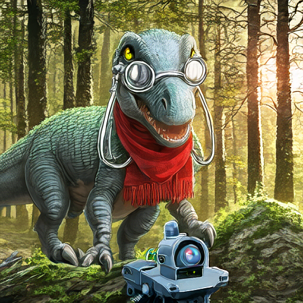

# Nanosaur2 Studio

[well9472/Nanosaur2-670M](https://huggingface.co/well9472/Nanosaur2-670M)をAikimi Forge Neoの`Nanosaur2`タブから使うテキスト画像生成機能です。完成したPNGと確定Seedを含む`parameters.json`を`outputs/nanosaur2/`へ保存します。画像参照編集とLoRA学習の操作は、このタブには実装していません。

## 導入

Neoを起動して`Nanosaur2`タブの「環境とモデルを準備」を押すか、Neoを終了して`aikimi-setup.bat`の`5`を選びます。CLIでは次を使えます。

```powershell
.\aikimi-setup.bat -Model nanosaur2
venv\Scripts\python.exe tools\setup_nanosaur2.py --verify
```

Windows・NVIDIA CUDA対応GPU・Git・インターネット接続が必要です。初回は固定版ComfyUI、Python 3.12、CUDA版PyTorchと3つのモデル（計約2.13 GB）を準備します。ComfyUIとPythonは`repositories/nanosaur2/`、モデルはその`ComfyUI/models/`に置きます。H3の実行環境・モデルは必要ありません。ダウンロードは中断後に同じ操作で再開できます。

| 配布ファイル | 保存先 |
|---|---|
| `nanosaur2_diffusion_model.safetensors` | `repositories/nanosaur2/ComfyUI/models/diffusion_models/` |
| `nanosaur2_text_encoder.safetensors` | `repositories/nanosaur2/ComfyUI/models/text_encoders/` |
| `nanosaur2_vae.safetensors` | `repositories/nanosaur2/ComfyUI/models/vae/` |

作者のノード5ファイルと重み3ファイルは[固定リビジョン](https://huggingface.co/well9472/Nanosaur2-670M/tree/dcd61cd6c3f9e2cc62619da620bd86219191c3ed)から取得し、サイズとSHA-256を確認します。ComfyUI本体は[固定コミット](https://github.com/Comfy-Org/ComfyUI/tree/912fca4f39b875a0360f2c5170568176ea813ded)を使用します。詳細は[manifest](../../tools/nanosaur2_manifest.json)に記載しています。既存のファイルが検証に失敗した場合は自動上書きを止めます。内容を確認して`--repair`を指定すると、そのファイルを退避して再取得できます。

## 画像を生成する

1. `Nanosaur2`タブを開き、プロンプトを入力します。初回は「環境とモデルを準備」を実行してください。
2. 解像度を選び、「画像を生成」を押します。`Seed=-1`は毎回ランダムです。
3. 完成したPNGと条件JSONを画面または`outputs/nanosaur2/`から開けます。

作者のモデルカードは **Euler / simple、50 steps、CFG 4、shift 3（モデル内部）、alternate guidance** を推奨しています。品質タグとして正のプロンプトの先頭に`newest, masterpiece`、負のプロンプトに`oldest, low quality`を挙げています。タブの初期値は50 steps・CFG 4・alternate guidanceです。正の品質タグは利用者が入力する方式です。最大画像サイズは約1.57MPに制限しています。

### アニメ二次元のプロンプト例

正のプロンプト：

```text
newest, masterpiece, anime illustration, 2d, 1girl, solo, short indigo hair, amber eyes, navy cloak embroidered with tiny stars, holding a brass telescope on a moonlit rooftop observatory, crisp line art, cel shading, deep blue sky, warm lantern light
```

負のプロンプト：

```text
oldest, low quality, blurry, photorealistic, 3d render, watermark, signature, text, bad anatomy, extra fingers
```

このプロンプトは特定の作品や作家を指定せず、人物・小道具・場所・線・塗りを直接記述しています。生成例は[アニメ二次元の実出力](../../docs/assets/nanosaur2-v2.4.0/anime_2d.png)です。

## 実画像の動作確認

RTX 3090で固定版のモデルとComfyUIから生成しました。画像は加工・再描画せず、モデル出力のPNGをそのまま掲載しています。再現用CLIは`venv\Scripts\python.exe tools\test_nanosaur2_live.py`です。

| 作例 | 条件 | 出力 |
|---|---|---|
| 森の探検家と小型ロボット | 512×512、50 steps、CFG 4、Seed 20260926、alternate、生成約10秒 | [PNG](../../docs/assets/nanosaur2-v2.4.0/sample.png) · [条件JSON](../../docs/assets/nanosaur2-v2.4.0/parameters.json) |
| アニメ二次元・天文台 | 768×1024、50 steps、CFG 4、Seed 424242、alternate、生成約12秒 | [PNG](../../docs/assets/nanosaur2-v2.4.0/anime_2d.png) · [条件JSON](../../docs/assets/nanosaur2-v2.4.0/anime_2d_parameters.json) |




モデル重みと作者ノードはGitに含めません。作者のモデルページはMITライセンスと研究用途を表示しています。利用前に[モデルカード](https://huggingface.co/well9472/Nanosaur2-670M)の現行の条件を確認してください。実行環境はローカルの`127.0.0.1:8189`を使用し、H3との同時起動は行いません。
